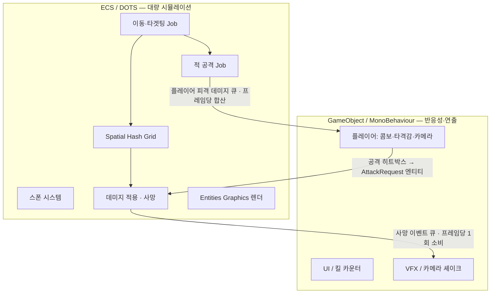
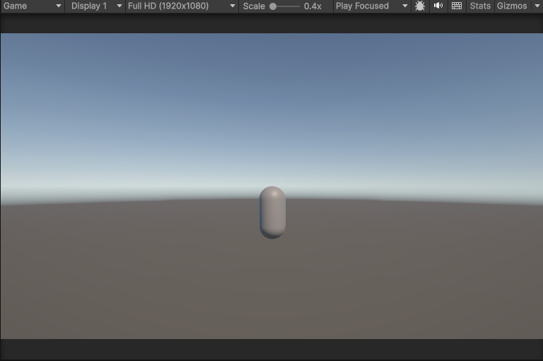
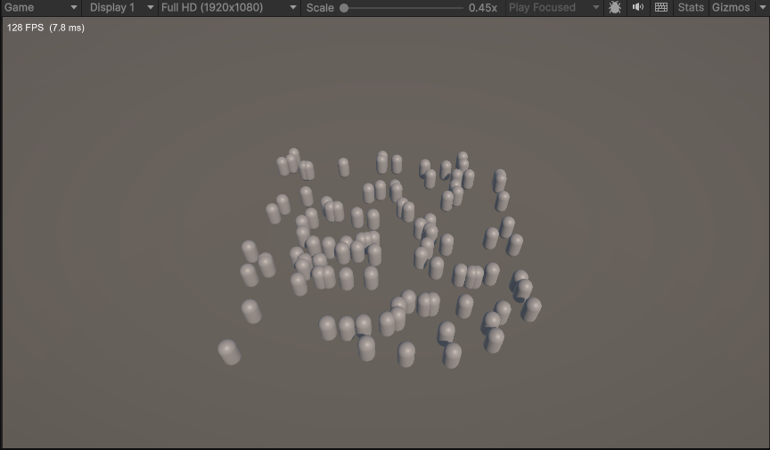

# ecs-warriors

> **Unity DOTS(ECS) 기반 3D 백뷰 무쌍 액션** — 화면에 적 수천 마리, 광역기 한 방에 날려도 프레임을 유지하는 데이터 지향 전투 구현.


-orange)

---

## 프로젝트 소개

삼국무쌍 오리진 스타일의 **3D 오버숄더 액션**을 세로 슬라이스로 구현한 포트폴리오 프로젝트입니다.
플레이어 1명이 수천 마리의 잡몹을 상대하며, **광역기 한 방에 화면이 정리되는 손맛**을 목표로 합니다.

이 프로젝트가 증명하려는 것은 "ECS 문법을 안다"가 아니라 두 가지입니다.

1. **병목을 찾고 개선할 줄 안다** — 프로파일링 → 원인 진단 → 최적화 → 수치 개선의 사이클.
2. **기술을 적재적소에 쓸 줄 안다** — 전부 ECS로 밀어붙이지 않고, 플레이어의 액션감은 GameObject로, 대량 군중만 ECS로 처리하는 판단.

그래서 이 저장소의 **본체는 게임이 아니라 "최적화 케이스 스터디"** 입니다. 같은 로직을 단계별로 개선하며 프레임타임을 측정·기록하고, before/after 데이터로 실력을 증명합니다. (아래 [최적화 케이스 스터디](#최적화-케이스-스터디-) 참고.)

---

## 기술 스택

| 영역 | 스택 | 버전 |
|---|---|---|
| 에디터 | Unity | **6000.5.4f1** (Unity 6.5) |
| 시뮬레이션 | Entities (ECS) | **6.5.0** |
| 렌더링 | Entities Graphics (GPU 인스턴싱) | **6.5.0** |
| 컴파일 | Burst (SIMD / 네이티브) | 1.8.29 |
| 컨테이너 | Collections | 6.5.0 |
| 수학 | Mathematics (SIMD) | 1.4.0 |
| 물리 (보조) | Unity Physics | 6.5.0 |
| 렌더 파이프라인 | Universal RP | 17.5.0 |
| 입력 | Input System | 1.19.0 |
| 플레이어/연출 | GameObject · MonoBehaviour | — |
| 프로파일링 | Unity Profiler · Burst Inspector | — |

> DOTS 패키지는 `com.unity.feature.ecs`로 설치되며 Unity 6.5부터 **에디터 버전과 정렬된 6.5.x**로 배포됩니다.

---

## 아키텍처 — 하이브리드 설계

전부 ECS가 정답은 아닙니다. **경계를 어디에 긋느냐**가 이 프로젝트의 핵심 설계 결정입니다.



- **플레이어 → ECS (공격)**: 공격 시 `EntityCommandBuffer`로 **AttackRequest 엔티티**를 스폰 → ECS 시스템이 Spatial Grid로 범위 내 적을 조회해 데미지 버퍼에 기록. (순수 데이터 흐름, Job 친화적.)
- **ECS → 플레이어 (적 사망)**: 사망 이벤트를 네이티브 큐에 모아 **메인 스레드에서 프레임당 1회 소비** → VFX·카메라 셰이크·킬 카운트.
- **ECS → 플레이어 (적의 공격, 양방향 전투)**: 적이 사거리 안이면 쿨다운마다 **플레이어 피격 데미지**를 큐에 push → 플레이어 GO가 프레임당 합산해 **HP 차감·피격 연출·패배 판정**. 적에게 둘러싸이면 플레이어도 죽을 수 있다. (HP의 소유자는 GO, ECS는 스냅샷만 읽는 단방향 데이터 흐름.)

> **왜 플레이어는 ECS가 아닌가?** 애니메이션 캔슬·입력 버퍼·타격 프레임 튜닝은 반복 이터레이션이 잦은데 ECS는 그 비용이 높습니다. 객체 1개를 위해 ECS 오버헤드를 지불할 이유가 없습니다.

---

## 최적화 케이스 스터디 ❤️

이 프로젝트가 파는 상품입니다. 같은 적 수·같은 씬 기준으로 단계별 프레임타임을 측정합니다.

| 단계 | 구현 | 기대 병목 | 측정 지표 | 상태 |
|---|---|---|---|---|
| ① 순진 | MonoBehaviour + O(n²) 근접탐색 | 메인스레드 CPU 포화 | 적 N마리별 프레임타임(ms) | 🚧 예정 |
| ② ECS 전환 | Entities, 싱글스레드 | 캐시 미스↓ | 동일 | 🚧 예정 |
| ③ Burst + Job | 병렬 잡 + SIMD | 워커스레드 활용 | 코어별 부하 분산 | 🚧 예정 |
| ④ Spatial Hashing | 그리드 근접탐색 | 알고리즘 개선 | 근접탐색 잡 시간 | 🚧 예정 |
| ⑤ 렌더 최적화 | Entities Graphics 인스턴싱 | 드로우콜↓ | 드로우콜 수, GPU 타임 | 🚧 예정 |

> ①단계 순진한 버전은 처음부터 별도 브랜치(`bench/01-naive`)로 유지 → 벤치마크의 출발점.
> 측정 데이터·그래프·Profiler 캡처는 Week 5 최적화 스프린트에서 이 섹션에 채워집니다.

**적 수 목표**: 화면 내 활성 1,500~3,000 + 총 5,000~10,000을 슬라이더로 조절, FPS 오버레이로 노출.

---

## 개발 로드맵 (6~8주)

| 주차 | 내용 | 산출물 | 상태 |
|---|---|---|---|
| **W0** | DOTS 셋업 · asmdef · 첫 컴포넌트 · SubScene 렌더 파이프라인 | 캡슐 엔티티 인스턴싱 렌더 | ✅ 완료 |
| **W1** | 스폰 시스템 · 카운트 슬라이더 · FPS 오버레이 | 1만 마리 정적 렌더 | 🟡 진행 중 |
| **W2** | 군중 이동 · Spatial Grid (+ `bench/01-naive` 분기) | 수천 마리 군집 추적 | ⬜ |
| **W3** | GO 플레이어 · 공격↔ECS 브릿지 · 데미지/사망 | 핵심 게임루프 성립 | ⬜ |
| **W4** | 경직/넉백 · 광역기 · 미니보스 · 사망 연출 | 광역기 한 방에 화면 정리 | ⬜ |
| **W5** | 🔬 최적화 스프린트 (①~⑤ 측정·개선) | 벤치마크 데이터셋 | ⬜ |
| **W6** | 애니메이션 · 폴리시 · 승리조건 | "완성"처럼 보이는 세로 슬라이스 | ⬜ |
| **W7~8** | 문서화 · 데모 영상 · 배포 (버퍼) | 제출 가능한 포폴 | ⬜ |

상세 태스크 분해는 [`docs/작업계획.md`](docs/작업계획.md) 참고. 주차별 진행 기록은 `docs/Week*.md` (예: [`Week0-DOTS셋업.md`](docs/Week0-DOTS셋업.md)).

---

## 개발 진행

### Week 0 — DOTS 셋업 & 첫 엔티티 렌더 ✅

빈 URP 프로젝트에서 시작해 **SubScene 베이킹으로 만든 엔티티를 Entities Graphics로 렌더**하는 데까지. 커스텀 코드 없이 캡슐 GameObject가 엔티티(`LocalTransform` + `RenderMeshArray` + `MaterialMeshInfo`)로 변환되어 GPU 인스턴싱으로 그려진다.



- DOTS 6.5.0 설치 + 버전 확정 · Unity CLI Loop(CLI 모드) 검증 파이프라인 구축
- `ECSWarriors.Simulation` asmdef (참조 5개) · 첫 unmanaged 컴포넌트 `Enemy`/`Velocity`
- `EnemySubScene` 베이킹 → 캡슐 엔티티 렌더 확인

### Week 1 — 스폰 시스템 & FPS 오버레이 🟡

몬스터 프리팹을 **엔티티 프리팹으로 베이킹**하고, `SpawnSystem`(`ISystem`)이 런타임에 `EntityManager.Instantiate`로 N마리를 스폰한다. FPS/ms 오버레이로 프레임타임을 노출.



- `Monster` 프리팹 + `SpawnAuthoring`/`SpawnBaker` → `SpawnConfig`(프리팹 핸들·수·반경) 베이킹
- `SpawnSystem` 100마리 지면 분포 스폰 · `FpsOverlay`(GC-free, 128 FPS 확인)
- **남은 것**: 카운트 슬라이더(목표 수 맞춤 스폰/제거) · 1만 마리 스트레스 테스트 → 상세 [`docs/Week1-스폰.md`](docs/Week1-스폰.md)

---

## 프로젝트 구조

```
Assets/
  Scripts/
    Simulation/                       # ECS 코어 (ECSWarriors.Simulation asmdef)
      Components/                     #   Enemy, Velocity, SpawnConfig (IComponentData)
      Authoring/                      #   SpawnAuthoring + SpawnBaker
      Systems/                        #   SpawnSystem (ISystem)  · Movement/Spatial/Combat 예정
      # Bridge/ (GO↔ECS 브릿지)는 Week 3에 추가
    UI/                               # FpsOverlay (MonoBehaviour) · 카운트 슬라이더 예정
  Prefabs/
    Monster.prefab                    # 스폰 원본(콜라이더 제거)
  Scenes/
    Main.unity                        # EnemySubScene(SubScene) — Spawner 포함
docs/
  작업계획.md         # 실행 계획 (기획 → 작업 분해)
  협업방식.md         # 작업 합의 (짝 프로그래밍 + 검수)
  Week0-DOTS셋업.md   # 주차별 진행 기록
  Week1-스폰.md       #   (Week2-... 로 이어짐)
  images/            # 진행 스크린샷
```

---

## 빌드 / 실행

**요구 사항**: Unity **6000.5.4f1** (Unity Hub에서 동일 버전 설치 권장 — DOTS 패키지는 버전에 민감)

```bash
git clone https://github.com/SeoBYP/ecs-warriors.git
```

1. Unity Hub에서 프로젝트를 연다 (패키지는 최초 실행 시 자동 복원).
2. `Assets/Scenes/Main.unity`(현재는 `SampleScene.unity`)를 연다.
3. Play.

---

## 문서

- [`docs/작업계획.md`](docs/작업계획.md) — 개발 작업 계획서 (현재 상태 · 아키텍처 확정 · 주차별 실행 태스크 · 벤치마크 하니스)
- 기획·설계 원문 및 개발 일지는 별도 Obsidian 볼트에서 관리.

---

*이 프로젝트는 개발 중(WIP)입니다. 데모 GIF·벤치마크 그래프·기술 결정 Q&A는 개발 진행에 따라 이 문서에 채워집니다.*
