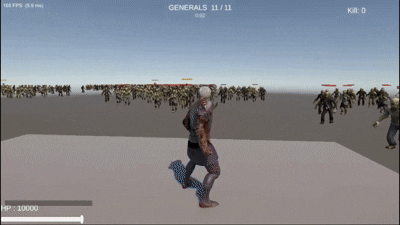
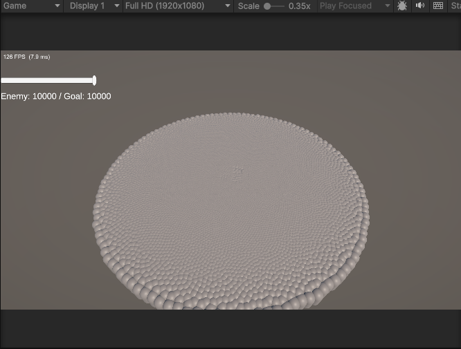
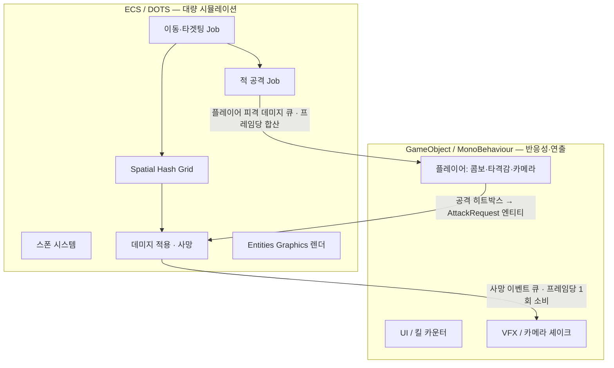
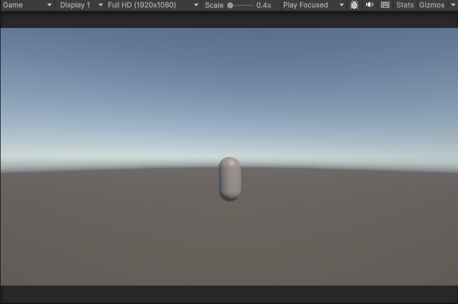
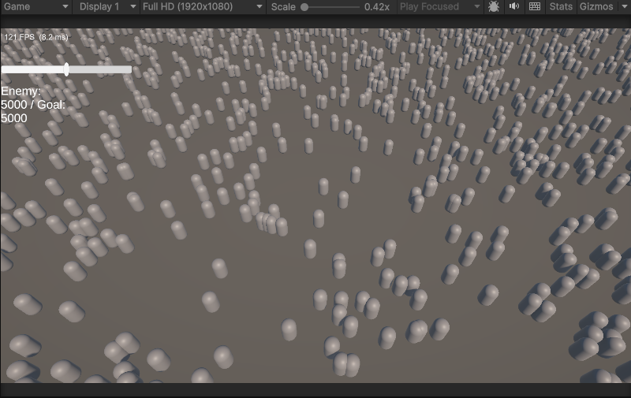
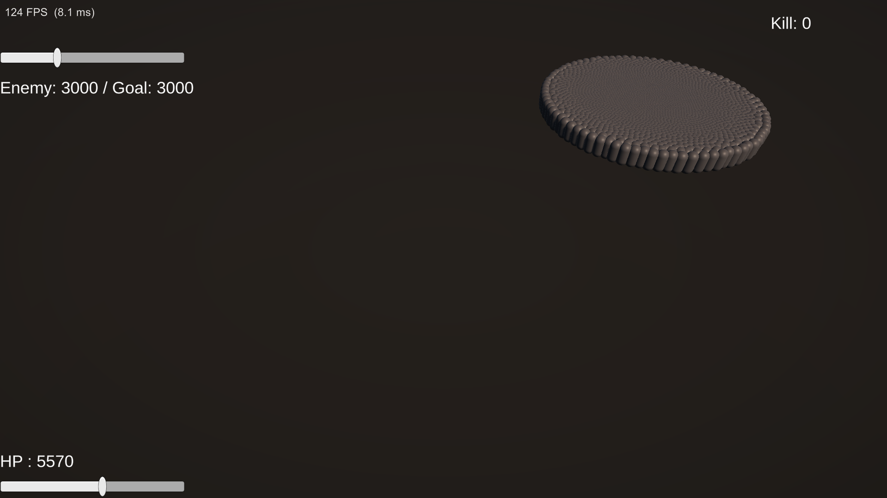
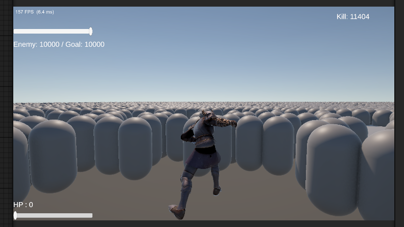
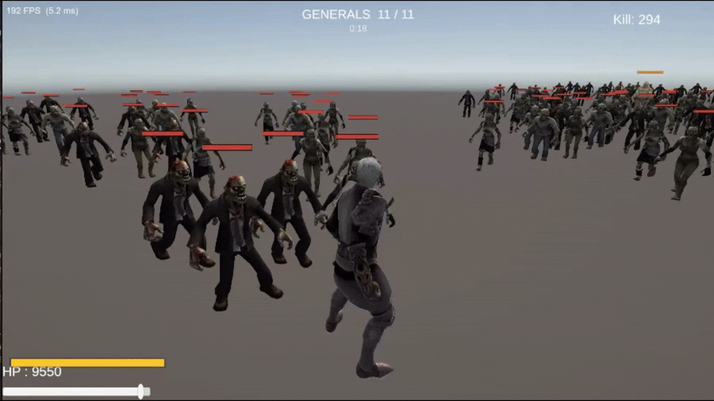

# ecs-warriors

> **Unity DOTS(ECS) 기반 3D 백뷰 무쌍 액션** — 화면에 적 수천 마리, 광역기 한 방에 날려도 프레임을 유지하는 데이터 지향 전투 구현.




> 편성된 적진(장수 11 · 병사 1,300)에 뛰어들어 콤보 → 무쌍난무로 정리하는 실제 플레이.

## TL;DR

> **적 10,000마리가 서로 회피하며 몰려들고, 플레이어와 서로 주고받는 양방향 전투 @ 107 FPS (9.37 ms)** — `IJobEntity` + Burst 병렬 잡 + Spatial Hash 근접 탐색.
>
> 그리고 지금은 **한 판이 성립하는 무쌍**이다 — 편성된 적진(**장수 11 + 병사 1,300**)에 뛰어들어 콤보·띄우기·무쌍난무로 쓸어담고, 장수를 베는 순간 **세계가 1초 멈추며**(히트스톱 → 보스는 슬로모), 전멸시키면 **MISSION CLEAR + 클리어 타임**이 뜬다.
>
> 이웃 탐색을 O(n²) 전수 검사에서 **Spatial Hash Grid로 바꿔 1만 마리에서 19.60 ms → 6.26 ms (3.13×)**. 더 중요한 건 **기울기** — 그리드 버전은 적이 1천이든 1만이든 프레임타임이 **평평하다**.
> 그리고 그 위에 **전투 시스템(1만 마리 거리 판정 + 데미지 적용)을 얹어도 기울기는 여전히 0**이다. 기울기를 가진 건 O(n²) naive뿐(**+13.25**).
> 그 최적화가 **어디서** 오는지 4단으로 쪼갰다 — 같은 O(n²)에 한 기법씩 얹어 **Burst 49× · 병렬화 3.7× · 알고리즘 1.6×**로 이득을 분리 측정(Week 5).
> → 측정 데이터: [Week2](docs/benchmarks/week2-separation.csv) · [Week3 A/B](docs/benchmarks/week3-combat-ab.csv) · [Week4 A/B](docs/benchmarks/week4-deadtag-ab.csv) · [Week5 래더](docs/benchmarks/week5-ladder.csv) · 분석: [Week2](docs/Week2-이동-SpatialHash.md) · [Week3](docs/Week3-전투-양방향브릿지.md) · [Week4](docs/Week4-광역기-구조변경벤치.md) · [Week5](docs/Week5-벤치하니스-프로파일러격리.md)



---

## 프로젝트 소개

삼국무쌍 오리진 스타일의 **3D 오버숄더 액션**을 세로 슬라이스로 구현한 포트폴리오 프로젝트입니다.
플레이어 1명이 수천 마리의 잡몹을 상대하며, **광역기 한 방에 화면이 정리되는 손맛**을 목표로 합니다.

이 프로젝트가 증명하려는 것은 "ECS 문법을 안다"가 아니라 두 가지입니다.

1. **병목을 찾고 개선할 줄 안다** — 프로파일링 → 원인 진단 → 최적화 → 수치 개선의 사이클.
2. **기술을 적재적소에 쓸 줄 안다** — 전부 ECS로 밀어붙이지 않고, 플레이어의 액션감은 GameObject로, 대량 군중만 ECS로 처리하는 판단.

그래서 이 저장소의 **1부는 "최적화 케이스 스터디"** 입니다. 같은 로직을 단계별로 개선하며 프레임타임을 측정·기록하고, before/after 데이터로 실력을 증명합니다. (아래 [최적화 케이스 스터디](#최적화-케이스-스터디-) 참고.)

**2부는 "그 위에 올린 게임"** 입니다(Week 7~10). 케이스 스터디 ①~⑥의 데이터를 확보한 뒤, 목표를 *"벤치마크가 도는 씬"* 에서 **"한 판이 재밌는 무쌍"** 으로 옮겼습니다 — 편성·보스·손맛·특수기·게임 루프. 여기서의 관전 포인트는 성능이 아니라 **"이미 만든 것을 얼마나 재사용해 기능을 얹느냐"** 입니다. Week 3에서 공격을 *데이터*(`AttackRequest`)로 설계한 덕에 광역기 → 4타 콤보 → 무쌍난무 → 띄우기가 **전부 새 전투 시스템 없이** 붙었습니다.

### 게임플레이 · 조작

| 입력 | 동작 |
|---|---|
| `WASD` / 마우스 | 이동(스트레이프) · 시점 |
| 좌클릭 | 4타 콤보 (히트 프레임 = 무기 궤적 판정) |
| 우클릭 | 광역 **강타** — 반경 25 · 넉백 5 (Y축 띄우기는 현재 0으로 꺼둠) |
| `R` | **무쌍난무** — 게이지 만땅 시 7.55초간 무적 + 11타(ComboB2·B4 5회 + B5 마무리) |
| `Space` | **회피** — 대시 + i-frame(콤보 캔슬 가능) |
| `Enter` | 결과 화면에서 리트라이 |

**승리 = 장수 11기 전멸 / 패배 = 플레이어 HP 0.** 병사 1,300은 무한 스펙터클 담당.

---

## 기술 스택

| 영역 | 스택 | 버전 |
|---|---|---|
| 에디터 | Unity | **6000.5.4f1** (Unity 6.5) |
| 시뮬레이션 | Entities (ECS) | **6.5.0** |
| 렌더링 | Entities Graphics (GPU 인스턴싱) | **6.5.0** |
| 컴파일 | Burst (SIMD / 네이티브) | 1.8.29 |
| 컨테이너 | Collections | 6.5.0 |
| 수학 | Mathematics (SIMD) | 1.4.0 |
| 물리 (보조) | Unity Physics | 6.5.0 |
| 렌더 파이프라인 | Universal RP | 17.5.0 |
| 입력 | Input System | 1.19.0 |
| 플레이어/연출 | GameObject · MonoBehaviour | — |
| 프로파일링 | Unity Profiler · Burst Inspector | — |

> DOTS 패키지는 `com.unity.feature.ecs`로 설치되며 Unity 6.5부터 **에디터 버전과 정렬된 6.5.x**로 배포됩니다.

---

## 아키텍처 — 하이브리드 설계

전부 ECS가 정답은 아닙니다. **경계를 어디에 긋느냐**가 이 프로젝트의 핵심 설계 결정입니다.


```mermaid
flowchart TD
    subgraph GO["GameObject / MonoBehaviour — 반응성·연출"]
        P[플레이어: 콤보·타격감·카메라]
        UI[UI / 킬 카운터]
        VFX[VFX / 카메라 셰이크]
    end
    subgraph ECS["ECS / DOTS — 대량 시뮬레이션"]
        SP[스폰 시스템]
        MV[이동·타겟팅 Job]
        SH[Spatial Hash Grid]
        EA[적 공격 Job]
        DMG[데미지 적용 · 사망]
        RND[Entities Graphics 렌더]
    end
    P -->|공격 히트박스 → AttackRequest 엔티티| DMG
    MV --> SH
    SH --> DMG
    MV --> EA
    DMG -->|사망 이벤트 큐 · 프레임당 1회 소비| VFX
    EA -->|플레이어 피격 데미지 큐 · 프레임당 합산| P
```

- **플레이어 → ECS (공격)**: 공격 시 `EntityCommandBuffer`로 **AttackRequest 엔티티**를 스폰 → ECS 시스템이 Spatial Grid로 범위 내 적을 조회해 데미지 버퍼에 기록. (순수 데이터 흐름, Job 친화적.)
- **ECS → 플레이어 (적 사망)**: 사망 이벤트를 네이티브 큐에 모아 **메인 스레드에서 프레임당 1회 소비** → VFX·카메라 셰이크·킬 카운트.
- **ECS → 플레이어 (적의 공격, 양방향 전투)**: 적이 사거리 안이면 쿨다운마다 **플레이어 피격 데미지**를 큐에 push → 플레이어 GO가 프레임당 합산해 **HP 차감·피격 연출·패배 판정**. 적에게 둘러싸이면 플레이어도 죽을 수 있다. (HP의 소유자는 GO, ECS는 스냅샷만 읽는 단방향 데이터 흐름.)

> **왜 플레이어는 ECS가 아닌가?** 애니메이션 캔슬·입력 버퍼·타격 프레임 튜닝은 반복 이터레이션이 잦은데 ECS는 그 비용이 높습니다. 객체 1개를 위해 ECS 오버헤드를 지불할 이유가 없습니다.

---

## 최적화 케이스 스터디 ❤️

이 프로젝트가 파는 상품입니다. 같은 적 수·같은 씬 기준으로 단계별 프레임타임을 측정합니다.

| 단계 | 구현 | 기대 병목 | 측정 지표 | 상태 |
|---|---|---|---|---|
| ① 순진 | MonoBehaviour + O(n²) 근접탐색 | 메인스레드 CPU 포화 | 적 N마리별 프레임타임(ms) | 🔬 래더 `cs-naive` 단(비Burst O(n²)) |
| ② ECS 전환 | Entities, 싱글스레드 | 캐시 미스↓ | 동일 | 🔬 래더 `single` 단(Burst 1스레드) |
| ③ Burst + Job | 병렬 잡 + SIMD | 워커스레드 활용 | 코어별 부하 분산 | ✅ **래더: Burst 49× · 병렬 3.7×** |
| ④ Spatial Hashing | 그리드 근접탐색 | 알고리즘 개선 | 근접탐색 잡 시간 | ✅ **1만 @ 19.60ms → 6.26ms (3.13×)** |
| ⑤ 렌더 최적화 | Entities Graphics 인스턴싱 (VAT) | 드로우콜↓ | 드로우콜 수, GPU 타임 | ✅ **VAT/SMR A/B: 5천 55× · 1만 @ 198fps** |
| ⑥ **API 선택** | Enableable vs AddComponent | **구조 변경 / 동기화** | 동시 사망 프레임 스파이크 | ✅ **1만 동시 사망 42.26 → 31.71ms (+33%, t=5.87)** |

> ⑥은 앞의 단계들과 **결이 다르다.** ①~⑤가 "느린 걸 빠르게"라면, ⑥은 **결과가 똑같은 두 API 중 무엇을 고르나**의 문제다. 코드도 4파일 몇 줄 차이인데 프레임 스파이크가 33% 갈린다.

> 순진한 버전은 별도 브랜치(`bench/01-naive`)로 유지 → 벤치마크의 출발점.

### ④ Spatial Hash 실측 (동일 조건, 이웃 탐색 방법만 교체)

| 적 수 | naive O(n²) | **grid** Spatial Hash | 개선 |
|---:|---:|---:|---:|
| 1,000 | 6.35 ms | 6.51 ms | 0.98× (손익분기점 미만) |
| 2,500 | 7.60 ms | 6.14 ms | 1.24× |
| 5,000 | 9.25 ms | 6.21 ms | 1.49× |
| **10,000** | **19.60 ms (51 fps)** | **6.26 ms (160 fps)** | **3.13×** |

**핵심은 기울기다** — grid는 1천이든 1만이든 **~6.2ms로 평평**(이웃 탐색 비용 ≈ 0), naive는 5천을 넘기며 무너진다. 원본: [`docs/benchmarks/week2-separation.csv`](docs/benchmarks/week2-separation.csv) · 분석: [`docs/Week2-이동-SpatialHash.md`](docs/Week2-이동-SpatialHash.md)

> 정직한 관찰: naive도 **51 fps로 돈다**. 양쪽 다 Burst+SIMD+멀티코어를 쓰기 때문 — 즉 이건 "느린 O(n²) vs 빠른 알고리즘"이 아니라 **"Burst로 최적화된 O(n²) vs Burst + 알고리즘"** 의 비교다. 그리고 1,000마리에선 그리드가 **오히려 손해**다(해시맵 재구축 오버헤드). 최적화엔 손익분기점이 있다.

### 단계별 래더 — 한 기법씩 격리 (cs-naive→single→parallel→grid) ✅

④가 "naive vs grid" 2단 비교라면, Week 5엔 같은 O(n²) 이웃 탐색을 **한 번에 한 기법씩** 올려 4단으로 쪼갰다. 각 단이 정확히 하나만 바꾸므로 그 단의 이득이 격리된다. **에디터 재시작 직후 한 세션에서 4단 연속 측정**(`Counts={1000,2000,3000}`, warmup60/sample60).

| 단 | 알고리즘 | Burst | 스케줄 | `main_ms` @3,000 |
|---|---|:-:|---|---:|
| **cs-naive** | O(n²) 전수검사 | ✗ | 1스레드 | **737.1** (1.3 fps) |
| **single** | O(n²) 전수검사 | ✓ | 1스레드 | 15.05 (62 fps) |
| **parallel** | O(n²) 전수검사 | ✓ | 병렬 | 4.09 (192 fps) |
| **grid** | O(n) 공간 해시 | ✓ | 병렬 | **2.49** (281 fps) |

| 전환 | 격리되는 이득 | 배수 |
|---|---|---:|
| cs-naive → single | **Burst** (SIMD·인라이닝) | **49×** |
| single → parallel | **병렬화** (워커 분산) | **3.7×** |
| parallel → grid | **알고리즘** (O(n²)→O(n)) | **1.6×** |
| **cs-naive → grid** | 합산 | **296×** |

**Burst 이득이 압도적이고 N에 비례해 커진다**(1천 21× → 3천 49×) — 한 줄 `[BurstCompile]`이 이 래더의 단일 최대 이득. 반면 **병렬화만으론 부족**하다: parallel도 O(n²)라 카운트를 키우면 결국 무너지고(5천 7.34ms), **알고리즘을 바꿔야 기울기가 0**이 된다(grid만 평평). 실비용은 `main_ms`에만 잡힌다 — `SpatialHashSystem_ms`는 4단 모두 **0.001ms**(OnUpdate 스케줄링만 계측), 실연산은 워커에서 돌아 sync point에서 메인을 막는다. 원본: [`docs/benchmarks/week5-ladder.csv`](docs/benchmarks/week5-ladder.csv) · 분석: [`docs/Week5-벤치하니스-프로파일러격리.md`](docs/Week5-벤치하니스-프로파일러격리.md)

### ⑥ 구조 변경 실측 — Enableable vs AddComponent (각 n=20)

광역기 한 방으로 **9,600마리 동시 사망**을 만들고 그 프레임의 스파이크를 측정. `DeadTag`를 표시하는 방법만 바꿨다.

| | **Enableable** (main) | **AddComponent** (`bench/05-deadtag-structural`) |
|---|---:|---:|
| 스파이크 최대 | **31.71 ms** (sd 6.96) | **42.26 ms** (sd 4.03) |
| 범위 | 24.26 ~ 44.38 | **34.20** ~ 51.63 |
| | | **+10.55 ms (+33%) · t = 5.87** |

**AddComponent 20라운드 중 최고 성적(34.20ms)이 Enableable의 평균(31.71ms)보다 나쁘다.** 원본: [`docs/benchmarks/week4-deadtag-ab.csv`](docs/benchmarks/week4-deadtag-ab.csv) · 분석: [`docs/Week4-광역기-구조변경벤치.md`](docs/Week4-광역기-구조변경벤치.md)

**왜 갈리나** — "비트라서 싸다"가 절반, **"비트라서 병렬로 할 수 있다"** 가 나머지 절반이고 이쪽이 더 크다. 구조 변경은 [공식 문서](https://docs.unity3d.com/Packages/com.unity.entities@6.5/manual/concepts-structural-changes.html)상 *"only on the main thread; not from jobs"* 라, `AddComponent`는 ECB에 1만 건을 예약한 뒤 **메인 스레드가 혼자 하나씩** 재생해야 한다. **1만 명이 동시에 vs 1명이 순서대로.**

> 방법론 관찰: **같은 40라운드 데이터로 결론이 갈렸다.** 처음 쓴 `초과분 합` 지표는 `t=1.03`(결론 불가)이었고 **음수까지 나왔다**(기준선을 빼는 구조라 노이즈가 2배). `스파이크 최대`로 바꾸니 `t=5.87`. 그리고 n=5에선 `t=1.27`이라 아무 말도 못 했다 — **지표 설계와 표본 수가 결론을 만든다.**

**적 수 목표**: 화면 내 활성 1,500~3,000 + 총 5,000~10,000을 슬라이더로 조절, FPS 오버레이로 노출.

### ⑦ 빌드 실측 — 에디터가 아니라 실제 플레이어에서 ✅

위 ④~⑥은 **전부 에디터 플레이 기준**이다. 에디터엔 세이프티 체크·프로파일러·씬뷰 오버헤드가 얹혀 있어 절대 수치를 그대로 주장할 수 없다. 같은 하니스를 **스탠드얼론 빌드에서** 돌려 재측정했다.

측정 환경: Ryzen 7 7800X3D (8C/16T) · RTX 4070 Ti SUPER · 32GB · Windows 11
빌드: Mono · Development · 1920×1080 창모드 · warmup 300 / sample 120

| 적 수 | avg_ms | p95_ms | fps | main_ms | gpu_ms | 드로우콜 |
|---:|---:|---:|---:|---:|---:|---:|
| 1,000 | 1.86 | 6.81 | 538.8 | 1.43 | 0.31 | 7 |
| 5,000 | 1.93 | 2.46 | 517.9 | 1.92 | 0.50 | 7 |
| **10,000** | **2.77** | **3.12** | **361.1** | 2.75 | 0.54 | 14 |

**적 수를 10배 늘려도 프레임타임은 1.5배**(1.86 → 2.77ms) — grid 공간해시가 N에 거의 평평하다는 ⑤의 결론이 빌드에서도 성립한다. 드로우콜이 7~14개뿐인 건 BRG가 VAT 군중을 인스턴싱으로 묶기 때문.

측정은 **브랜치별로 자동화**돼 있다 — `tools/bench/run-build-bench.ps1`이 변형마다 체크아웃 → 빌드 → 실행 → CSV 수집을 반복하므로, 래더 4단을 빌드에서 다시 재는 것도 명령 한 줄이다.

원본: [`docs/benchmarks/build/grid.csv`](docs/benchmarks/build/grid.csv) · 절차·함정: [`docs/benchmarks/README-빌드실측.md`](docs/benchmarks/README-빌드실측.md)

---

## 개발 로드맵

| 주차 | 내용 | 산출물 | 상태 |
|---|---|---|---|
| **W0** | DOTS 셋업 · asmdef · 첫 컴포넌트 · SubScene 렌더 파이프라인 | 캡슐 엔티티 인스턴싱 렌더 | ✅ 완료 |
| **W1** | 스폰 시스템 · 카운트 슬라이더 · FPS 오버레이 | 1만 마리 @ ~156 FPS + 슬라이더 | ✅ 완료 |
| **W2** | 군중 이동 · Spatial Grid (+ `bench/01-naive` 분기) | 1만 군집 @ 160fps + **④단계 벤치 3.13×** | ✅ 완료 |
| **W3** | GO 플레이어 · 공격↔ECS 브릿지 · 데미지/사망 · 적→플레이어 공격 | 핵심 게임루프 성립 + **전투 A/B 벤치** | ✅ 완료 |
| **W4** | 캐릭터·4타 콤보·무기 영역 판정·루트모션 · 광역기·넉백·경직 · 플레이어 사망 | 무쌍 손맛 + **⑥ 구조 변경 A/B (+33%)** | ✅ 완료 |
| **W5** | 🔬 벤치 하니스 확장(시스템 마커 격리) · 단계별 래더 | 프로파일러 격리 + 4단 래더 CSV | ✅ 완료 |
| **W6** | VAT 군중 애니메이션(1만 상태머신) · 넉백→사망 연출 | **⑤ VAT/SMR A/B 55×** | ✅ 완료 |
| **W7** | 보스·엘리트 티어(하이브리드) · 편성 스폰 · 병사 다양화 | 장수 11 + 병사 1,300 편성 | ✅ 완료 |
| **W8** | 히트스톱 손맛 · 카메라 셰이크 · 보스 슬로모 | 리더 킬 → 세계 정지 | ✅ 완료 |
| **W9** | 무쌍난무 · 게임 루프(승/패·리트라이) · 회피 | **한 판이 성립** | ✅ 완료 |
| **W10** | 저글링(띄우기) · Y 소유권 정리 | 공중 띄우기 + 3D 오염 제거 | ✅ 완료 |
| **W11** | 콤보 커맨드 · 폴리싱(히트 플래시·사운드) · 데모 영상 · 빌드 | 제출 가능한 포폴 | ⬜ 진행 예정 |

상세 태스크 분해는 [`docs/작업계획.md`](docs/작업계획.md) 참고. 주차별 진행 기록은 `docs/Week*.md` (예: [`Week0-DOTS셋업.md`](docs/Week0-DOTS셋업.md)).

---

## 1부 — 기반과 최적화 (Week 0~6)

### Week 0 — DOTS 셋업 & 첫 엔티티 렌더 ✅

빈 URP 프로젝트에서 시작해 **SubScene 베이킹으로 만든 엔티티를 Entities Graphics로 렌더**하는 데까지. 커스텀 코드 없이 캡슐 GameObject가 엔티티(`LocalTransform` + `RenderMeshArray` + `MaterialMeshInfo`)로 변환되어 GPU 인스턴싱으로 그려진다.



- DOTS 6.5.0 설치 + 버전 확정 · Unity CLI Loop(CLI 모드) 검증 파이프라인 구축
- `ECSWarriors.Simulation` asmdef (참조 5개) · 첫 unmanaged 컴포넌트 `Enemy`/`Velocity`
- `EnemySubScene` 베이킹 → 캡슐 엔티티 렌더 확인

### Week 1 — 스폰 시스템 · FPS 오버레이 · 카운트 슬라이더 ✅

몬스터 프리팹을 **엔티티 프리팹으로 베이킹**하고, `SpawnSystem`(`ISystem`)이 런타임에 `SpawnConfig.Count`를 목표치로 삼아 **부족하면 스폰 / 넘치면 디스폰**한다. uGUI 슬라이더로 목표 수를 실시간 조절하고, Text로 현재 적 수를 표시.



- `Monster` 프리팹 + `SpawnAuthoring`/`SpawnBaker` → `SpawnConfig` 베이킹, `MonsterAuthoring`으로 `Enemy` 태그 부착
- `SpawnSystem`(목표 수 유지: spawn/despawn diff) · `FpsOverlay`(GC-free)
- `SpawnCountSlider`: 슬라이더 → `SpawnConfig.Count`(GO→ECS 쓰기) + Update 폴링으로 적 수 Text 표시(ECS→GO 읽기)
- **🔬 1만 마리 @ ~120–156 FPS** (GPU 인스턴싱) → 상세 [`docs/Week1-스폰.md`](docs/Week1-스폰.md)

### Week 2 — 군중 이동 · Spatial Hash · 벤치마크 ④ ✅

`IJobEntity` + Burst로 1만 마리를 병렬 이동시키고, **Spatial Hash Grid**(셀 크기 = 회피 반경)로 이웃을 3×3 셀만 조회해 회피시킨다. 한 점에 뭉치던 덩어리가 **균일한 원반 군집**으로 펴진다.


- `MovementSystem`(IJobEntity+Burst+ScheduleParallel) — 등속 추적 + StopDistance 정지
- `SpatialHashSystem` — `NativeParallelMultiHashMap` 매 프레임 재구축(ParallelWriter) → `SeparationJob`이 3×3 셀만 조회
- **④단계 벤치마크 확보**: 1만에서 **19.60ms → 6.26ms (3.13×)**, grid는 적 수와 무관하게 평평 → 상세 [`docs/Week2-이동-SpatialHash.md`](docs/Week2-이동-SpatialHash.md)

### Week 3 — 양방향 전투 · GO↔ECS 브릿지 · 전투 A/B 벤치 ✅

플레이어(GameObject)와 적 1만(ECS)이 **서로 주고받는** 전투를 완성했다. 핵심은 두 세계를 잇는 **브릿지 3종**이고, 각각 **방향과 모양이 다르다**.



| 브릿지 | 방향 | 방식 |
|---|---|---|
| `PlayerStateBridge` | GO → ECS | 싱글톤 **덮어쓰기** (최신값 1개) |
| `PlayerAttackBridge` | GO → ECS | **요청 엔티티** 던지기 (사건 1건) |
| `DeathEventBridge` · `PlayerHealthBridge` | **ECS → GO** | **`NativeQueue` 싱글톤** (사건 N건) |

- `AttackResolveSystem` — **Week2의 Spatial Hash 재사용**해 반경 내 적 조회 → `DamageEvent` 버퍼에 누적
- `DamageApplySystem` / `DeathSystem` — 버퍼 합산 → HP 차감 → `DeadTag`(**`IEnableableComponent`**, 1만 동시 사망 시 구조 변경 회피) → 사망 이벤트 큐
- `EnemyAttackSystem` — 1만 마리 병렬 쿨다운·거리 판정 → `AsParallelWriter()`로 플레이어 데미지 큐에 push
- **🔬 전투 A/B**: 전투 전부 켬 vs 끔을 **같은 세션에서** 측정 → **기울기 +0.84로 여전히 평평** → 상세 [`docs/Week3-전투-양방향브릿지.md`](docs/Week3-전투-양방향브릿지.md)

> 정직한 관찰: 처음엔 "Week3(9.37ms) − Week2 grid(6.26ms) = 전투 비용 3ms"라고 결론 낼 뻔했다. **틀렸다** — 전투를 **전부 끈** 조건도 7.76ms라, 차이의 절반 이상이 코드와 무관한 **세션 간 베이스라인 드리프트**였다. **cross-session 절대값 비교는 무효**이고, 유효한 건 같은 세션 A/B와 기울기뿐이다.

### Week 4 — 캐릭터·4타 콤보 · 광역기·넉백·경직 · 구조 변경 벤치 ⑥ ✅

캡슐 플레이어를 실제 캐릭터로 바꾸고 **무쌍류 4타 콤보**를 붙였다. 그리고 **광역기 한 방에 화면이 정리되는 손맛**(넉백 + 경직)까지 완성했다. 이번 주의 헤드라인은 **Week 3에서 공격을 "요청 엔티티 + 파라미터"로 설계해둔 복리** — 광역기도 근접 콤보도 **새 ECS 시스템 0개**로 얹혔다.



**액션 · 근접 콤보** — 상세 [`docs/Week4-캐릭터-콤보-루트모션.md`](docs/Week4-캐릭터-콤보-루트모션.md)

- **근접 판정 = 가상 영역 쿼리**: DOTS엔 콜라이더가 없다(적은 인스턴싱 캡슐 수천 개). 무기(손) 위치로 **Week 2의 `SpatialHash` 반경 쿼리를 그대로 재사용** — 회피·광역기가 쓰던 그 쿼리다. `OnAttackStart`~`End` 사이 **매 프레임** 손 위치로 `AttackRequest`를 발사해 손이 아크를 그리며 훑는다.
- **스윙당 1히트 (`SwingId`)**: 한 적이 여러 프레임 맞지 않게 스윙마다 ID를 증가시켜 중복 제거. `SwingId=0`이면 단발이라 **기존 광역기가 안 깨진다** — 새 시스템 0개, 필드 하나로 끝. 검증: 한 스윙에 1,258마리 **전부 정확히 1히트**, 중복 0.
- **콤보를 코드가 모른다**: 4타 체이닝은 **순수 Animator 상태 기계**이고 코드 변경 0. "각 콤보 타 = 새 SwingId"만으로 코드는 콤보 인덱스에 무지한 채 정확하다. 판정 기점(왼손/오른손)·강타 배수(Combo4 = 2배)는 **Animation Event 파라미터**로 클립마다 지정.
- **루트모션**: 콤보 클립에 이미 baked된 전진(0.77~1.42 m/s)이 `applyRootMotion=false`로 버려지고 있었다 — **켜기만 하면 됐다.** `clip.averageSpeed`를 먼저 찍어 "이미 들어있음"을 확인한 덕에 클립 재작업 헛수고를 피했다.

**손맛 · 대량 사망 · 벤치** — 상세 [`docs/Week4-광역기-구조변경벤치.md`](docs/Week4-광역기-구조변경벤치.md)

- **광역기 = 숫자만 바꾸기**: `Radius=25, Damage=100`을 던지면 그게 광역기다. 별도 `AoeRequest` 타입도 시스템 분기도 없다. 검증: 1회에 킬 카운터 **정확히 +10,000**.
- **넉백**: `DamageEvent` 버퍼 스키마를 처음 확장(`+SourcePos, +KnockbackScale`). `Amount`는 더하면 그만이지만 **방향은 아니다** — 사방에서 맞으면 상쇄되므로 **"최대 데미지 1건" 기준**의 결정론적 넉백. 검증: `MovementSystem` 정지 후 1만 전원 정확히 `+5.00`, `normalize(0)`→NaN 가드 확인.
- **경직 (`Stun`)**: `DamageApplySystem`(쓰기) ↔ `MovementSystem`(읽기)이 처음으로 **계약**을 맺는다. 계약은 *무엇을 공유하나*뿐 아니라 **"언제 확인하나"**(거리 체크 앞)까지 맞아야 한다.
- **플레이어 사망**: 브릿지에 `Health`가 아니라 **`bool IsDead` 한 비트**만 — 적은 "몇 HP 남았나"가 아니라 때릴지 말지만 알면 된다. `EnemyAttackSystem`은 시스템에서 조기 반환해 사망 후 **1만 순회 자체를 건너뛴다.**
- **🔬 ⑥ 구조 변경 A/B**: `DeadTag`를 Enableable vs AddComponent로 측정 → **1만 동시 사망 스파이크 +33% (t=5.87)**. 상세는 위 [최적화 케이스 스터디](#최적화-케이스-스터디-)의 ⑥.

> 정직한 관찰: 경직 가드를 거리 체크 **뒤**에 뒀더니 플레이어에 붙어 있는 적들의 경직 타이머가 얼어붙었다 — 그런데 **넉백이 이 버그를 가려줬다.** 넉백이 적을 사거리 밖으로 밀어내면 다음 프레임엔 정상 동작해서, 광역기 데모는 "밀렸다 → 잠깐 멈췄다 → 온다"로 **정확히 보인다.** 로직은 틀렸는데 화면은 맞다. 넉백을 `0`으로 꺼 격리하고서야 드러났다.

### Week 5 — 벤치 하니스 확장 · 단계별 래더 ✅

"총 프레임타임"만 재던 `BenchmarkHarness`를 **어디서 시간이 드는지**(CPU 메인 · GPU · 시스템별 마커 · 드로우콜)까지 `ProfilerRecorder`로 확장하고, 같은 O(n²) 이웃 탐색을 한 기법씩 올려 **cs-naive → single → parallel → grid** 4단으로 격리 측정했다.

- **함정 둘 (실측에서 드러남)**: ① 프로파일러 카운터는 상수명이 아니라 `GetAvailable()`로 **이름을 열거**해 찾아야 하고(8,062개 중), ② 병렬 잡 마커는 `SumAllSamplesInFrame` 없이는 워커 하나치만 잡혀 **N에 안 비례하는 가짜 상수**가 나온다.
- **🔬 단계별 래더**: 3천 마리 기준 Burst **49×** → 병렬화 **3.7×** → 알고리즘 **1.6×**(합산 296×). 각 단이 기법 하나씩 격리 — 상세는 위 [최적화 케이스 스터디](#최적화-케이스-스터디-)의 **단계별 래더**.
- **🔬 상태머신 무비용 재확인**: `TrackedSystems`에 `ZombieAnimSystem`을 넣어 재보니 1만 마리에도 **0.001ms** — 전환되는 순간에만 파라미터를 쓰고 나머진 읽기+분기라 grid separation처럼 프로파일에서 사라진다.
- 상세 [`docs/Week5-벤치하니스-프로파일러격리.md`](docs/Week5-벤치하니스-프로파일러격리.md)

> 정직한 관찰: 같은 grid 코드가 재시작 직후 3.9ms@5000 → 30분+ 플레이 뒤 38ms@5000으로 **10배** 벌어졌다(ECS 마커는 바닥, `main_ms`만 폭발 = **세션 드리프트**). 래더는 **에디터 재시작 직후 4단을 연달아** 재야 유효 — 그래서 cs-naive 단은 새 세션 첫 순서로 측정했다.

### Week 6 — VAT 군중 애니메이션 (1만 마리 상태머신) ✅

캡슐이던 잡몹을 **실제 좀비 메시**로 바꾸자마자 벽에 부딪혔다 — **전원 T포즈로 누워서** 몰려온 것이다. 버그가 아니라 필연이었다: 리깅된 메시는 정점이 **바인드 포즈(=T포즈)** 로 저장되고, `SkinnedMeshRenderer`가 매 프레임 뼈로 변형(**스키닝**)해야 포즈가 나온다. 그런데 ECS 인스턴싱은 `MeshFilter`로 그리고 **거기엔 스키닝이 없다.** 1만 마리에 `SkinnedMeshRenderer`를 달 수도 없다.



> 뼈도 Animator도 없이 셰이더가 텍스처를 읽어 재생한다. 이 군중 전체가 인스턴싱 몇 드로우콜.

**VAT (Vertex Animation Texture)** — 상세 [`docs/Week6-VAT-군중애니메이션.md`](docs/Week6-VAT-군중애니메이션.md)

- **계산에서 재생으로**: 매 프레임 뼈로 정점을 *계산*하는 대신, 정점의 프레임별 위치를 **텍스처에 미리 굽고**(가로=정점, 세로=프레임) 셰이더가 **읽어서 재생**한다. 뼈·Animator 없이 GPU 인스턴싱 1드로우콜. **메모리는 인스턴스 수와 무관** — 1만 마리가 텍스처 1장(클립당 164KB)을 공유한다.
- **멀티클립 상태머신**: 5클립(idle·walk·attack·damage·death)을 한 텍스처에 **세로로 스택**하고, `{startRow, frameCount, fps, loop}` 표를 **Blob 에셋**으로 구워 전 좀비가 공유(80바이트 1벌 + 핸들 8바이트). `ZombieAnimSystem`이 게임플레이 상태를 읽어 **전환되는 순간에만** 클립 파라미터를 갈아끼운다.
- **넉백 → 사망 순서 연출**: 넉백을 즉시 텔레포트에서 **0.25초 지속 이동**으로 바꾸고, 애니 우선순위에서 **넉백 > 사망**으로 둬 *"밀려나며 히트 모션 → 멈춘 뒤 쓰러지는 모션"* 을 만들었다. 사망 타이머는 넉백이 끝나야 시작한다(안 그러면 사망 모션이 잘림).
- **강타 = 넉백**: 1~3타는 제자리 히트, **4타와 우클릭만** 밀어낸다. 판정은 클립에 이미 박혀 있던 **`floatParameter`(강타 배수)** 로 — 코드가 콤보 인덱스를 모르는 Week 4의 설계를 그대로 잇는다.
- **🔬 VAT/SMR A/B 벤치**: 같은 메시(701정점)로 렌더+애니만 비교 → SMR은 N에 선형(5천 158ms·6fps)인데 VAT는 평평(**1만 @ 3.34ms·198fps**), **5천에서 55×**. 원본: [`docs/benchmarks/week6-vat-ab.csv`](docs/benchmarks/week6-vat-ab.csv) · 분석: 위 [최적화 케이스 스터디](#최적화-케이스-스터디-)의 ⑤ / [`docs/Week6-VAT-군중애니메이션.md`](docs/Week6-VAT-군중애니메이션.md)

> 정직한 관찰 셋. **①** `EnabledRefRO<DeadTag>`를 쿼리에 넣으면 상태를 읽을 수는 있지만 **"켜진 것만" 필터가 그대로 살아있어** 매칭 엔티티가 **0개**가 됐다 — 잡은 도는데 1만 마리가 전부 미초기화. `IgnoreComponentEnabledState`가 필요했고, 프로브로 `[기본]=0 vs [Ignore]=10000`을 찍어 확정했다. **②** 초기 상태를 `Idle`로 두면 처음부터 idle인 좀비는 전환이 없어 **영영 초기화가 안 된다** — `None(255)` 센티널로 첫 프레임을 강제했다. **③** "4타만 넉백"을 `IsName("Combo4")`로 판정했더니 항상 false였다. 애니 이벤트는 **전환이 끝나기 전(t=0.33s)에 발사**되어 아직 Combo3으로 보인다. 우클릭은 Animator를 안 거쳐 멀쩡했던 탓에 "4타만 안 되는" 증상으로 나타났다.

---

## 2부 — 그 위에 올린 게임 (Week 7~10)

케이스 스터디 데이터를 확보한 뒤 목표를 **"한 판이 재밌는 무쌍"** 으로 옮겼다. 이 구간의 관전 포인트는 프레임타임이 아니라 **재사용률**이다.

### Week 7 — 보스·엘리트 티어 & 편성 스폰 ✅

잡몹만 1만 마리인 전장에 **장수**를 세웠다. 핵심 질문은 하나였다 — **리더를 어느 세계에 둘 것인가.**

<!-- TODO: 폴리싱 후 GIF (편성된 적진 + Hulk 보스) -->

- **결정: 리더 = ECS 엔티티(시뮬) + GameObject(비주얼)** — 순수 GO 리더 안을 폐기했다. 리더도 `Enemy` 엔티티라 **기존 `AttackResolveSystem`이 그대로 때린다(새 피격 코드 0줄)**. GO는 `LeaderVisualBridge`가 엔티티를 따라다니며 렌더·Animator만 담당. 근거·트레이드오프는 [`Week7 §6 ADR`](docs/Week7-보스엘리트-편성스폰-설계.md).
- **편성 스폰**: 보스 1(호위 300) + 엘리트 10(호위 100) = **리더 11기 + 병사 1,300**. `MonsterDefinition`/`SquadDefinition`/`StageDefinition` SO로 데이터 주도.
- **병사 다양화**: 좀비 5종을 VAT로 굽고 **가중 랜덤 스폰** + 몬스터별 이동속도. 감지범위(40) 밖 병사는 대기 → 편성이 유지된다.
- **발 속도 동기화**: 걷기 클립의 실제 지면속도(**1.154 m/s**)를 `averageSpeed`로 재고, `_AnimParams.z`(fps)를 이동속도 비례로 스케일 → **풋 슬라이딩 제거**. 속도를 바꿔도 보행 템포가 자동으로 맞는다.

> 정직한 관찰: **여성 좀비 40%가 애니 정지 상태**였다. 여성 메시는 submesh가 2개라 Entities Graphics가 렌더를 **자식 엔티티로 분리**하는데, Baker가 루트에만 붙인 `[MaterialProperty]`(VAT 애니 값)를 자식이 못 받아 머티리얼 기본값으로 굳은 것. 렌더 엔티티 1,820개 중 **1,040개가 애니 값 없음**으로 계측돼 확정했고, 자식에 컴포넌트를 달아 부모 값을 복사하는 시스템으로 해결.

### Week 8 — 히트스톱 손맛 ✅

**장수를 벤 순간 세계가 멈춘다.** 무쌍의 "한 방의 카타르시스"를 만드는 구간.

<!-- TODO: 폴리싱 후 GIF (보스 처치 순간 프리즈 + 셰이크 + 슬로모) -->

- **프리즈는 글로벌 `timeScale` 금지** — 1만 마리가 계속 죽는 게임이라 겹치면 영구 정지가 된다. 대신 `HitStop` 싱글톤을 각 시스템이 읽어 **early-return**(이동·해시·넉백·VAT 시계). GO(플레이어·리더 애니)는 브릿지가 정지시킨다.
- **트리거는 `DeathSystem`이 직접** — `DeathEventQueue`를 소비하는 안을 폐기했다. 킬카운트 브릿지가 이미 큐를 드레인하고 있어, 소비자가 둘이면 **"가끔 히트스톱이 안 걸리는"** 재현 어려운 버그가 된다. *큐 소비자는 1명, 나머지는 결과를 읽는다.*
- **강도**: 보스 1.0s / 엘리트 0.7s / **병사는 트리거 안 함**. 카메라 셰이크는 Cinemachine Impulse, **보스만 슬로모**(0.3배 → 1.2s 램프).
- **슬로모만 글로벌 `timeScale`을 쓴다** — 프리즈와 성격이 다르다. 보스 처치는 스테이지당 1회·한정 시간이고, 플레이어·카메라·군중이 **같이** 느려져야 자연스럽다.
- **리더 넉백 면역**(`knockbackFactor` 데이터) — 넉백이 끝나야 사망 타이머가 시작돼 프리즈가 늦었다. 면역 후 **frame+14 → frame+1**(벤 즉시).

> 정직한 관찰: 처음 플레이에서 "안 멈춘다"는 보고를 받았다. 트리거 버그를 의심했지만 **원인은 리더 HP 4000** — 죽일 수가 없어 트리거가 실전에서 한 번도 발동하지 못한 것이었다. 데미지를 직접 주입한 내 검증만으로는 못 잡는 종류의 문제.

### Week 9 — 무쌍난무 · 게임 루프 · 회피 ✅

**"데모"가 "게임"이 되는 주차.** 시그니처 기술과 시작·끝을 붙였다.

<!-- TODO: 폴리싱 후 GIF (무쌍난무 발동 → 화면 정리) -->

- **무쌍난무 = 광역기의 반복** — 킬로 게이지를 채워 `R`로 발동, **7.55초 동안 11타 + 무적**. **ECS 신규 코드 0**(`AttackRequest`를 짧은 간격으로 여러 번 쏠 뿐). Week 3 "공격=데이터"의 **네 번째 배당**.
  타이밍을 하드코딩하지 않는다 — `ComboB2·B4`를 5회 반복하고 `B5`로 마무리하는 **클립 길이에서 재생·타격 시각표를 만든다**. 각 클립은 스윙이 끝나는 60% 지점에서 끊어 다음 타로 넘겨 속도감을 낸다(전진 10.6m, 판정은 평타와 동일한 반경 2.5·넉백 0).
- **게임 상태는 ECS가 소유** — `StageState` 싱글톤(Phase·남은 리더·경과시간)을 시스템이 갱신하고 UI는 **읽어서 그리기만** 한다. UI가 승리 조건을 판정하면 규칙이 늘어날 때 UI와 규칙이 얽힌다.
- **회피**: `Space` 대시(5m/0.25s) + i-frame + 쿨다운, **콤보 캔슬 허용**.
- **무적을 bool → 만료 시각으로** — 소유자가 둘(무쌍난무·회피)이 되는 순간 bool은 깨진다. 무쌍난무 무적 중 회피가 끝나면 **남은 무적까지 꺼진다.** `max(만료시각)`으로 합치면 서로 취소하지 않는다(히트스톱의 `max(Remaining)`과 같은 패턴).

> 정직한 관찰 둘. **①** 리트라이가 **씬 리로드만으로는 안 된다** — ECS World는 씬과 무관하게 살아남아 싱글톤이 이전 판 값을 유지하고, 런타임 스폰 병사도 안 사라진다(리로드 직후 결과 화면이 다시 뜨고 병사가 두 배). **②** 그 정리 과정에서 `DestroyEntity(EntityQuery)`가 예외를 던졌다 — 여성 좀비의 `LinkedEntityGroup`(자식 렌더 엔티티)이 쿼리에 없어서. 배열 오버로드로 바꿔 해결. Week 7의 submesh 이슈가 두 번째로 청구서를 보냈다.

### Week 10 — 저글링(띄우기) ✅

계획서가 **"가장 큰 단일 조각"** 으로 표시해둔 작업. 이유는 코드량이 아니라 **모든 시스템이 "적은 바닥(y=0)"을 암묵적으로 전제**하고 있었기 때문이다.

<!-- TODO: 폴리싱 후 GIF (우클릭 → 좀비 수백이 동시에 떠오르는 장면) -->

- **새 파이프라인이 아니라 수직 성분 한 칸**: `AttackRequest.LaunchY` → `DamageEvent.LaunchY` → `Airborne`(enableable) + 중력·착지. 계획서가 예고한 *"넉백은 이미 있으니 수직만 추가"* 가 그대로 성립했다.
- **Y 소유권을 `AirborneSystem` 하나로** 못박고, 다른 시스템은 수평만 건드리게 계약을 정리했다.
- 체공 중엔 **지상 행동 금지**(추적·공격), 피격 모션 재생, 사망해도 **착지 후** 쓰러진다.
- 리더는 `knockbackFactor=0`이라 **띄워지지도 않는다**(넉백 면역과 같은 계수를 재사용).

> 정직한 관찰 — **함정 3개가 전부 "숨어 있던 3D"였다.** **①** `DamageApplyJob`에 enableable 컴포넌트를 받는 순간 **"꺼진"(=지상) 적이 쿼리에서 통째로 제외**돼 **데미지가 아예 안 들어갔다**(`[WithPresent]` 필요 — `DeadTag`에 이미 같은 이유로 붙어 있었다). **②** `MovementSystem`이 3D로 추적해, 루트모션으로 살짝 떠 있는 플레이어를 따라 **적이 공중으로 끌려 올라갔다.** **③** 분리(separation)도 3D라 밀집한 좀비가 서로를 **위로** 밀어 y가 무한 증가했다(maxY 5.5m). 새 축을 도입할 때 진짜 비용은 신규 시스템이 아니라 **기존 코드의 암묵적 전제를 찾아내는 것**이다.

---

## 프로젝트 구조

스크립트는 **타입별(Components/Systems)이 아니라 기능별**로 묶는다 — 한 기능의 컴포넌트·시스템·authoring이 한 폴더에 있어야 찾기 쉽다.

```
Assets/
  Scripts/
    Simulation/                       # ECS 코어 (ECSWarriors.Simulation asmdef)
      Core/                           #   SpatialHash(셀·해시 유틸) · PlayerState(+IsDead) · PlayerStateSystem
      Spawning/                       #   SpawnConfig · SpawnPrefab(가중 풀) · FormationSpawned(1회성 마커)
                                      #   SpawnAuthoring · SpawnSystem(편성 스폰: 리더 주위 스쿼드)
      Movement/                       #   MoveStats · SpatialHashMap · HashedEnemy
                                      #   MovementSystem(수평 추적·감지범위) · SpatialHashSystem(+SeparationJob)
      Combat/                         #   AttackRequest(반경·데미지·넉백·경직·LaunchY) · DamageEvent(버퍼)
                                      #   Health · DeadTag(enableable) · DeathTimer · Knockback · KnockbackFactor
                                      #   Stun · HitTracker · EnemyAttack · Airborne(enableable) · HitStop
                                      #   AttackResolve/DamageApply/Death/EnemyAttack/Knockback/Airborne/HitStop 시스템
      Enemies/                        #   Enemy · TierTag(Normal/Elite/Boss) · LeaderTag
                                      #   MonsterAuthoring · LeaderAuthoring (스탯·티어를 SO에서 굽는다)
      Animation/                      #   AnimClock · VATClipSet/VATClipTable(Blob) · ZombieAnim
                                      #   ZombieAnimSystem(상태머신) · VatAnimClockSystem(프리즈 가능한 전역 시계)
                                      #   VATSubmeshSyncSystem(다중 submesh 자식 렌더 엔티티 동기화)
      Stage/                          #   StageState(Phase·남은 리더·경과시간) · StageStateSystem(승/패 판정)
      Data/                           #   MonsterDefinition · SquadDefinition · StageDefinition · SpawnTable (SO)
      Bridge/                         #   PlayerStateBridge · PlayerAttackBridge (GO→ECS)
                                      #   DeathEventBridge · PlayerHealthBridge(i-frame) (ECS→GO, NativeQueue 소비)
                                      #   LeaderVisualBridge (리더 GO 스폰·추적·Animator 구동·HP바)
    Player/                           # PlayerController(이동·회피) · PlayerAnimationEventListener(콤보 히트프레임)
    Gameplay/                         # HitStopBridge(프리즈·셰이크·슬로모) · MusouGaugeBridge(무쌍난무)
                                      # StageUIBridge(HUD·결과·리트라이)
    UI/                               # FpsOverlay
    Editor/                           # VATBaker(멀티클립 스택 베이커) · VATBakerWindow
  Shaders/
    VAT_Zombie.shader                 # URP. 정점단계 텍스처 lookup으로 애니 재생 + DOTS 인스턴싱(_AnimTime으로 프리즈)
  Data/
    Monsters/                         # 몬스터·편성·스테이지 SO
    VAT/                              # VAT 클립셋·머티리얼 (좀비 5종)
    Animators/                        # 리더용 컨트롤러(Leader_Hulk · Leader_Tank)
  Prefabs/                            # Monster.prefab + 변종 4종
  Scenes/
    Main.unity                        # EnemySubScene(SubScene) — Spawner · 리더 11기 배치
docs/
  작업계획.md · 협업방식.md
  Week0~Week10*.md         # 주차별 진행 기록 + 설계·결정 기록(ADR)
  benchmarks/              # 측정 원본 CSV (week2-separation · week3-combat-ab · week4-deadtag-ab · week5-ladder · week6-vat-ab)
  images/                  # 진행 스크린샷
```

**브랜치**: `main`(최신 통합) · `bench/01-naive`(벤치마크 O(n²) 기준선 — 머지하지 않고 비교용 보존) · `bench/05-deadtag-structural`(⑥ DeadTag Enableable vs AddComponent A/B용) · `bench/week5-naive-grid`(cs-naive/single/parallel 변형 — 단계별 래더 측정용)

---

## 빌드 / 실행

**요구 사항**: Unity **6000.5.4f1** (Unity Hub에서 동일 버전 설치 권장 — DOTS 패키지는 버전에 민감)

```bash
git clone https://github.com/SeoBYP/ecs-warriors.git
```

1. Unity Hub에서 프로젝트를 연다 (패키지는 최초 실행 시 자동 복원).
2. `Assets/Scenes/Main.unity`를 연다.
3. Play → `WASD` 이동, 좌클릭 콤보, 우클릭 띄우기, `R` 무쌍난무, `Space` 회피.

> 적 수는 `EnemySubScene`의 `SpawnAuthoring`(편성별 호위 수·반경)에서, 손맛 수치는 `DeathSystem`(프리즈 길이)·`HitStopBridge`(셰이크·슬로모)·`MusouGaugeBridge`(무쌍난무) 인스펙터에서 조절한다.

---

## 문서

- [`docs/작업계획.md`](docs/작업계획.md) — 개발 작업 계획서 (현재 상태 · 아키텍처 확정 · 주차별 실행 태스크 · 백로그)

**주차별 기록 · 설계 결정(ADR)**

| 문서 | 핵심 내용 |
|---|---|
| [Week 2](docs/Week2-이동-SpatialHash.md) · [Week 3](docs/Week3-전투-양방향브릿지.md) | Spatial Hash 벤치 ④ · GO↔ECS 브릿지 3종 + 전투 A/B |
| [Week 4 (벤치)](docs/Week4-광역기-구조변경벤치.md) · [Week 4 (액션)](docs/Week4-캐릭터-콤보-루트모션.md) | 구조 변경 A/B ⑥ · 4타 콤보·무기 영역 판정 |
| [Week 5](docs/Week5-벤치하니스-프로파일러격리.md) · [Week 6](docs/Week6-VAT-군중애니메이션.md) | 4단 래더(기법별 격리) · VAT 군중 애니 ⑤ |
| [Week 7](docs/Week7-보스엘리트-편성스폰-설계.md) | **리더 아키텍처 ADR**(ECS 엔티티 + GO 비주얼) · 편성 스폰 |
| [Week 8](docs/Week8-히트스톱-손맛.md) | **히트스톱 트리거 위치 ADR** · 영구 프리즈 함정 · 폴리싱 백로그 |
| [Week 9](docs/Week9-무쌍난무-게임루프.md) | 무쌍난무(재사용) · **게임 상태 소유권 ADR** · i-frame 설계 |
| [Week 10](docs/Week10-저글링-콤보커맨드.md) | 띄우기 + **3D 오염 3건** · 콤보 커맨드 설계(보류) |

> 각 문서는 "무엇을 만들었나"보다 **"왜 그렇게 결정했나"**(후보 비교 → 채택 이유 → 감수한 트레이드오프)에 지면을 씁니다.

- 기획·설계 원문 및 개발 일지는 별도 Obsidian 볼트에서 관리.

---

## 남은 작업 (W11)

- **콤보 커맨드** — 진삼국무쌍식 "약공 N타 → 강공" 파생(설계·클립 조사 완료, [Week 10 §2](docs/Week10-저글링-콤보커맨드.md))
- **폴리싱** — 히트 플래시(타격 가독성) · 리더 피격 반응 · 사운드 · 강도 튜닝
- **마감** — 데모 영상(60~90초) · itch.io 빌드

---

*개발 중(WIP) — 게임플레이·VAT GIF는 실제 플레이 캡처입니다. 데모 영상(60~90초)은 폴리싱 완료 후 채웁니다.*
