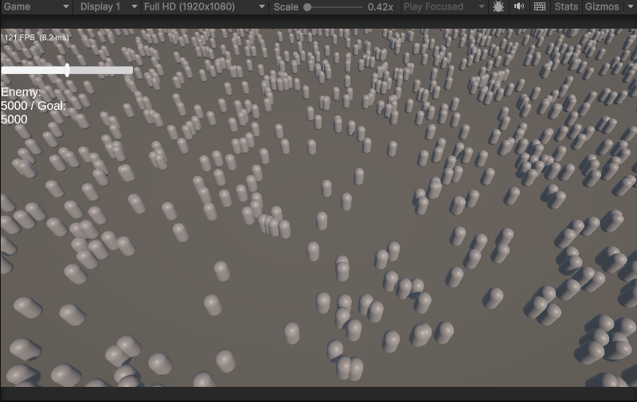

# Week 1 — 스폰 시스템 · FPS 오버레이 · 카운트 슬라이더

> 주차별 진행 기록. 계획은 [`작업계획.md`](작업계획.md), 이전 주차는 [`Week0-DOTS셋업.md`](Week0-DOTS셋업.md).
> 상태: ✅ **완료**

**기간**: 2026-07-16
**목표**: 런타임 엔티티 스폰 + FPS/ms 오버레이 + 슬라이더로 적 수 실시간 조절. **DoD: 1만 마리 + 슬라이더 → 달성.**



---

## Step 1. 몬스터 프리팹

- Week 0의 SubScene 캡슐을 **Prefab 에셋**(`Assets/Prefabs/Monster.prefab`)으로 승격. 런타임 복제 원본.
- **Capsule Collider 제거** (자작 Spatial Hash 설계라 Physics 불필요 → 베이킹 슬림).

## Step 2. `SpawnConfig` 컴포넌트

```csharp
public struct SpawnConfig : IComponentData
{
    public Entity Prefab;   // 복제할 엔티티 프리팹 핸들
    public int Count;       // 목표 수 (슬라이더가 런타임에 갱신)
    public float Radius;
}
```

## Step 3. Authoring + Baker (프리팹 → 엔티티 프리팹)

- `SpawnAuthoring`(MonoBehaviour) + `SpawnBaker : Baker<SpawnAuthoring>`.
- `Bake()`: ① `GetEntity(None)`(스포너 자신) ② `GetEntity(authoring.Prefab, Dynamic)`(프리팹 → 엔티티 프리팹 핸들) ③ `AddComponent(entity, new SpawnConfig{...})`.
- **막힌 점**: Baker 클래스명을 `Baker`로 지어 `Unity.Entities.Baker`와 충돌(CS0308) → `SpawnBaker`로 개명. `Bake()` 본문 미완성(없는 타입, 프리팹 GetEntity 누락) → 3단계로 채움.

## Step 4. Spawner 배치 (SubScene)

- SubScene 안 빈 GameObject `Spawner` → `SpawnAuthoring` 부착 → Prefab=Monster, Count·Radius 설정.
- **막힌 점**: 코드만 있고 Spawner GameObject를 안 놔서 `SpawnConfig` 엔티티가 0개였음. **Baker는 authoring이 붙은 GameObject가 SubScene에 있어야 실행됨.**

## Step 5. `SpawnSystem` (ISystem) — 1회 스폰

- `RequireForUpdate<SpawnConfig>()` + `EntityManager.Instantiate(prefab, count, Temp)` 배치 스폰 + 위치를 Radius 원 안에 흩뿌림(Y=0).
- **막힌 점**: `RequireForUpdate` 누락 시 SubScene 로드 전 `GetSingleton` 예외 / 위치 Y 무작위 → 공중 큐브 → Y=0·`config.Radius` 사용 / 네임스페이스 `System` → `.NET System` 충돌 위험 → `Systems`.

## Step 6. `FpsOverlay` (FPS/ms 계기판)

- MonoBehaviour + `OnGUI`. `Time.unscaledDeltaTime` EMA 평활, `GUIStyle` **캐싱**(GC-free), 흰 텍스트.

## Step 7. 1만 마리 스트레스 테스트 🔬

| 적 수 | 프레임타임 |
|---|---|
| 100 | ~128 FPS |
| 5,000 | ~121 FPS |
| **10,000** | **~120–156 FPS (6.4–8.5 ms)** |

**1만 개 GPU 인스턴싱을 156 FPS로.** 벤치마크 ⑤단계(렌더 최적화)의 기준선이자, 나중에 "순진한 MonoBehaviour" 버전과 비교할 출발점.

## Step 8. `Enemy` 태그를 프리팹에 (MonsterAuthoring)

- 슬라이더로 **세고/지우려면 "적"을 식별**해야 함 → 스폰된 클론이 `Enemy` 태그를 가져야 함.
- **막힌 점(내 실수)**: SpawnBaker에서 `AddComponent<Enemy>(prefabEntity)` 하려다 **베이킹 예외** — `InvalidOperationException: Entity doesn't belong to the current authoring component`. **Baker는 자기 GameObject의 엔티티만 수정 가능**, 참조한 프리팹의 엔티티는 남의 것.
- **해결**: Monster 프리팹이 **자기 컴포넌트를 자기가 authoring** → `MonsterAuthoring` + `MonsterBaker`:
  ```csharp
  class MonsterBaker : Baker<MonsterAuthoring> {
      public override void Bake(MonsterAuthoring authoring) {
          var e = GetEntity(TransformUsageFlags.Dynamic);  // 자기 엔티티
          AddComponent<Enemy>(e);                          // 합법
      }
  }
  ```
  → Monster 프리팹에 `MonsterAuthoring` 부착. `GetEntity(prefab)` 시 프리팹이 이미 Enemy를 가진 채 구워지고 클론이 상속.

## Step 9. `SpawnSystem` → "목표 수 유지"로 개조

- `state.Enabled = false` 제거 → 매 프레임 현재 적 수를 목표(`Count`)에 맞춤:
  - `current < target` → 부족분 `Instantiate`
  - `current > target` → `enemyQuery.ToEntityArray` 후 `GetSubArray(0, count)`로 초과분만 `DestroyEntity`
- **막힌 점**: `ToEntityArray(alloc, count)` 오버로드 없음(CS1501) → 전부 뽑아 `GetSubArray(0,count)` / `else` → `else if (current > target)`(안정 상태에서 매 프레임 `ToEntityArray(전체)` 하는 낭비 제거).

## Step 10. 카운트 슬라이더 + 실시간 Text

- uGUI Slider(Min 0, Max 10000, Whole Numbers) + `SpawnCountSlider`(MonoBehaviour):
  - **쓰기(이벤트)**: `slider.onValueChanged` → `SpawnConfig.Count` 갱신 (GO→ECS)
  - **읽기(폴링)**: `Update`에서 캐싱된 Enemy 쿼리로 `CalculateEntityCount()` → Text 표시 (ECS→GO)
- **막힌 점**: `OnChanged`에서 캐싱한 `_enemyQuery`(Enemy용)를 SpawnConfig 쿼리로 **덮어써서** 슬라이더 움직인 뒤 카운트가 1로 고장 → **쓰기용 쿼리는 지역 변수**로 분리. / 한글 라벨 두부(□) → TMP 폰트에 한글 없음 → 영어 라벨.
- **검증**(런타임): 슬라이더 3000 → 적 10000→3000 + 라벨 정확 / 7000 → 3000→7000. 양방향 + 라벨 실시간 동작 확인.

> 생명주기·이벤트 흐름 상세는 학습노트로 정리: [[Unity DOTS 하이브리드 생명주기와 이벤트 흐름]]

---

## 이번 주 배운 것

- **베이킹으로 엔티티 프리팹** — `GetEntity(prefab, Dynamic)` + `TransformUsageFlags`. **Baker는 자기 엔티티만 수정** (남의 프리팹 엔티티 X → 프리팹은 자기 authoring으로).
- **`ISystem` 패턴** — `RequireForUpdate` + `Instantiate` 배치 + "목표 수 유지"(spawn/despawn diff).
- **GO↔ECS 흐름** — 쓰기는 이벤트(onValueChanged), 읽기는 Update 폴링(쿼리 캐싱). 월드는 Start에 보장되나 SubScene 엔티티는 async라 `IsEmpty` 방어.
- **컴파일 초록불 ≠ 검증** (반복) — 빈 Baker·Spawner 미배치·RequireForUpdate 누락·쿼리 덮어쓰기·씬 미연결 전부 컴파일 통과. 실행/쿼리/스크린샷으로 확인.
- **에디터 함정** — SubScene `MissingReferenceException`(Unity 에디터 버그, 무해) / 비포커스 시 Play 스로틀(`uloop focus-window`로 실측).

## 다음 (Week 2)

- [ ] 군중 이동 시스템 (`IJobEntity` + Burst, 플레이어 추적)
- [ ] Spatial Hash Grid (근접 탐색)
- [ ] ①순진한(naive) O(n²) 버전 `bench/01-naive` 브랜치 분기 (벤치마크 기준선)
- [ ] 오버레이 폴리시: `else if` 최적화 반영 여부 재확인, 슬라이더 초기값 동기화
