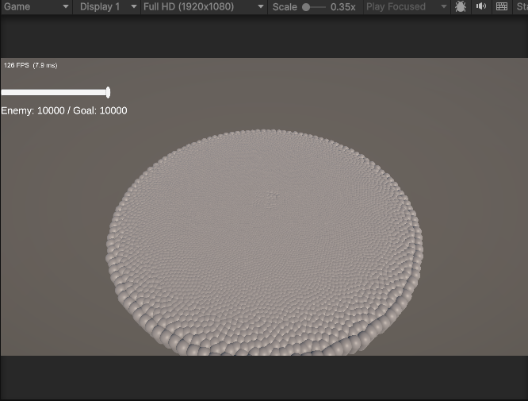

# Week 2 — 군중 이동 · Spatial Hash · 벤치마크 ④단계

> 주차별 진행 기록. 계획은 [`작업계획.md`](작업계획.md), 이전 주차는 [`Week1-스폰.md`](Week1-스폰.md).
> 상태: ✅ **완료** — 이동 · 이웃 회피 · **O(n²) vs Spatial Hash 벤치마크 데이터 확보**

**기간**: 2026-07-16 ~ 07-17
**목표**: `IJobEntity`+Burst 군중 이동 · Spatial Hash 이웃 탐색 · **naive 기준선 대비 측정**

---

## 🔬 벤치마크 ④단계: O(n²) → Spatial Hash (★ 이번 주의 결과물)

**동일 조건**(같은 씬·회피 수식·반경 1.0·세기 5, 워밍업 240프레임 후 120프레임 샘플, 비포커스 프레임 제외)에서 **이웃을 찾는 방법만** 바꿔 측정.

| 적 수 | naive O(n²) | **grid** Spatial Hash | 개선 |
|---:|---:|---:|---:|
| 1,000 | 6.35 ms (157 fps) | 6.51 ms (154 fps) | **0.98×** (오히려 손해) |
| 2,500 | 7.60 ms (132 fps) | 6.14 ms (163 fps) | 1.24× |
| 5,000 | 9.25 ms (108 fps) | 6.21 ms (161 fps) | 1.49× |
| **10,000** | **19.60 ms (51 fps)** | **6.26 ms (160 fps)** | **3.13×** |

원본 데이터: [`benchmarks/week2-separation.csv`](benchmarks/week2-separation.csv)

### 이 표가 말하는 것

**1. grid는 완전히 평평하다 (6.1~6.5ms).** 적이 1천이든 1만이든 **프레임타임이 그대로**다. 이 ~6.2ms는 렌더+이동+에디터 오버헤드인 **고정 비용**이고, 이웃 탐색 비용은 사실상 **0에 수렴**한다. → 셀 크기 = 회피 반경이라 밀도가 일정하면 **엔티티당 검사 수(k)가 상수**이기 때문. O(n·k)의 실제 모습.

**2. naive는 5,000을 넘기며 무너지기 시작한다.** 6.35 → 7.60 → 9.25 → **19.60**. 5,000→10,000에서 적이 2배 늘 때 **시간은 2.1배**가 아니라 그 이상으로 튄다(고정비용 ~6ms를 빼면 3.25ms → 13.3ms, **약 4배** = n² 그대로).

**3. 1,000에서는 grid가 오히려 진다 (6.51 vs 6.35).** 해시맵을 매 프레임 Clear+재구축하는 **고정 오버헤드**가 이득보다 크기 때문. → **최적화는 공짜가 아니다. 이 프로젝트에선 손익분기점이 대략 2,000마리 근처**다.

**4. 꼬리(p95)가 더 극적이다.** 10,000에서 naive p95 **28.94ms**(프레임 튐) vs grid **7.03ms**. 평균보다 체감 안정성 차이가 크다.

### 정직한 관찰: "O(n²) = 즉사"는 틀렸다

작업 전 예상은 "1억 번/프레임이면 프레임 폭사"였는데, **naive도 51 fps로 돌았다.** naive 역시 **Burst + SIMD + 멀티코어 병렬**을 그대로 쓰기 때문이다.
→ 즉 이 비교는 "느린 O(n²) vs 빠른 알고리즘"이 아니라 **"이미 Burst로 최적화된 O(n²) vs Burst + 알고리즘"** 이다.
**결론**: Burst만으로도 1억 연산이 51fps를 낸다. 그 위에 **알고리즘을 얹으면 3.13배가 더 나오고, 무엇보다 기울기가 0이 된다.**

---

## Step 1. 이동 시스템 (`IJobEntity` + Burst)

- `MoveStats{ Speed, StopDistance }` 컴포넌트 + `MonsterAuthoring`/Baker로 부착 (인스펙터 노출).
- `MovementSystem`: `[BurstCompile]` + `MoveJob : IJobEntity` + `.ScheduleParallel()`.
- **막힌 점 / 해결**:
  - `direction`을 **정규화 안 함** → 이동량이 거리에 비례(등속 X). 게다가 `k = Speed*dt > 1`이면 **overshoot/발산**하는 프레임레이트 의존 버그. → `math.normalize` 적용.
  - StopDistance 이내에서 `Position = Target`으로 **스냅** → 1만 마리가 한 점에 겹침. → `return`으로 **제자리 정지**.
- **검증**: 최대거리가 폴링마다 일정하게 -13씩 감소(= Speed 3 등속) · 최소거리 0.46 고정(스냅 없음) · 1만 @ 130fps.

## Step 2. Spatial Hash 그리드

- `SpatialHash` static 유틸: `CellSize=1` / `ToCell(pos)` / `Key(cell)` — **공간 해시 상수**(73856093 ^ 19349663).
- `SpatialHashSystem`: `NativeParallelMultiHashMap<int, float3>` **Persistent** 할당 → 매 프레임 `Clear()` + `AsParallelWriter()`로 병렬 Add → `OnDestroy`에서 `Dispose()`.
- **셀 크기 = 회피 반경(1.0)** — 그래야 "반경 내 이웃은 반드시 3×3 셀 안"이 보장됨.
- **막힌 점 / 해결**:
  - 해시 함수가 **두 개**였다(시스템의 `CellKey` vs 잡의 `x + y*1000`). 빌드와 조회가 다른 키를 쓰면 **이웃을 하나도 못 찾고 조용히 실패**한다. → `SpatialHash` static 클래스로 **단일화**.
  - `x + y*1000`은 현재 Radius(±100)에선 우연히 충돌이 없지만, **월드가 커지면**(셀 1000 이상) `(0,1)`과 `(1000,0)`이 충돌.
- **검증**: 1만 개 → **점유 셀 8,310개**(셀당 1.2마리, 해시 분산 양호).

## Step 3. 이웃 회피 (Separation)

- `SeparationJob`: 자기 셀 + 인접 8칸(**3×3만**) 조회 → `TryGetFirstValue`/`TryGetNextValue`로 순회 → 반경 내 이웃에서 밀어내는 벡터 누적.
- 맵을 소유한 `SpatialHashSystem`이 **빌드 잡 → 회피 잡**을 연달아 스케줄 (`state.Dependency` 자동 체인이라 순서 보장).
- **막힌 점 / 해결**: 잡을 정의만 하고 **`OnUpdate`에서 스케줄을 안 함** → 컴파일 초록불인데 회피가 아예 안 돎.
- **핵심 포인트**: `d > 0.0001f` 로 **자기 자신 제외**(맵엔 자기도 들어있어 `diff/d`가 NaN이 됨).
- **결과**: 한 점 덩어리 → **균일한 원반 군집**으로 전환 (위 스크린샷).

## Step 4. 벤치마크 하니스 & naive 브랜치

- `BenchmarkHarness`(MonoBehaviour): 적 수 구간을 **자동 스윕**하며 목표 세팅 → 스폰 완료 대기 → 워밍업 → 샘플 → `[BENCH]`/`[BENCH-CSV]` 로그.
- **비포커스 프레임 제외**(`Application.isFocused`) — 에디터가 백그라운드면 Unity가 게임 루프를 스로틀해서 프레임타임이 **실제 작업시간이 아니라 대기시간**이 된다. 이걸 안 거르면 측정이 통째로 무의미.
- `bench/01-naive` 브랜치: `SpatialHashSystem`을 **전수 검사 O(n²)** (`NaiveSeparationJob`)로 교체. 회피 수식·파라미터는 동일.

---

## 이번 주 배운 것

- **`IJobEntity`의 시그니처가 곧 쿼리** — `ref`(쓰기)/`in`(읽기 전용)로 소스 제너레이터가 쿼리·순회를 생성. `[BurstCompile]`은 잡·시스템 **둘 다**, `SystemAPI.Time.DeltaTime`(≠`Time.deltaTime`, Burst에서 터짐).
- **Spatial Hash의 본질** — 셀 크기를 질의 반경에 맞추면 3×3 셀로 반경 내 이웃이 **보장**되고, 밀도가 일정하면 엔티티당 검사 수가 **상수**가 된다 → 기울기 0.
- **빌드와 조회는 같은 해시** — 다르면 에러 없이 조용히 실패. 해시는 반드시 한 곳에.
- **네이티브 컨테이너 수명** — `Persistent`는 `OnDestroy`에서 `Dispose()` 필수. 병렬 Add엔 `AsParallelWriter()`.
- **최적화엔 손익분기점이 있다** — 1,000마리에선 그리드가 오히려 손해. "무조건 좋은 최적화"는 없다.
- **측정 방법론이 결과를 만든다** — 비포커스 스로틀 프레임을 안 걸렀으면 모든 수치가 쓰레기였다.
- **컴파일 초록불 ≠ 검증** (계속) — 해시 불일치·잡 미스케줄·정규화 누락 전부 컴파일 통과.

## 다음 (Week 3)

- [ ] GameObject 플레이어 (오버숄더 카메라, 지상 콤보)
- [ ] **공격 브릿지**: `AttackRequest` 엔티티 → `AttackResolveSystem`이 **이번 주 만든 Spatial Hash로** 범위 내 적 조회 → `DamageEvent`
- [ ] `DamageApplySystem` / `DeathSystem` + 사망 이벤트 큐 → GO 소비
- [ ] 적→플레이어 공격(`EnemyAttack`) — 양방향 전투
- [ ] (선택) 벤치마크 20,000까지 확장해 곡선 발산 구간 추가
