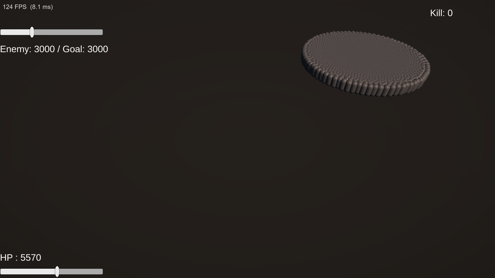

# Week 3 — 양방향 전투 · GO↔ECS 브릿지 · 벤치마크 A/B

> 주차별 진행 기록. 계획은 [`작업계획.md`](작업계획.md), 이전 주차는 [`Week2-이동-SpatialHash.md`](Week2-이동-SpatialHash.md).
> 상태: ✅ **완료** — 플레이어↔적 양방향 전투 · **ECS→GO 역방향 브릿지** · 전투 부하 A/B 측정

**기간**: 2026-07-17
**목표**: GO↔ECS 양방향 브릿지 · 데미지/사망 파이프라인 · 적→플레이어 공격 · **전투 시스템 부하 측정**



---

## 이번 주의 뼈대: 브릿지 3종

GameObject 세계(플레이어·입력·UI)와 ECS 세계(1만 마리)는 서로를 직접 못 본다. 통로를 3개 뚫었고, **방향과 모양이 각각 다르다**.

| 브릿지 | 방향 | 방식 | 왜 이 방식인가 |
|---|---|---|---|
| `PlayerStateBridge` | GO → ECS | 싱글톤 **덮어쓰기** | 매 프레임 최신값 1개면 충분 |
| `PlayerAttackBridge` | GO → ECS | **요청 엔티티** 던지기 | 사건 1건, 1프레임 수명 |
| `DeathEventBridge` / `PlayerHealthBridge` | **ECS → GO** | **`NativeQueue` 싱글톤** | 사건 N건, 수신자가 GO |

**엔티티를 "사건"으로 쓴 것**(`AttackRequest`)이 이번 주 개념적 수확 중 하나다. 데이터 지향에서 엔티티는 "물건"만이 아니다.

---

## 🔬 벤치마크: 전투 시스템을 얹으면 얼마나 느려지나

Week 2에서 확보한 "grid는 평평하다"에 **전투 시스템 5개를 얹으면 무너지는가?** 를 측정.

원본 데이터: [`benchmarks/week3-combat-ab.csv`](benchmarks/week3-combat-ab.csv)

| 적 수 | Week2 grid | **nocombat** | **noattack** | **week3** (전부 켬) | Week2 naive |
|---:|---:|---:|---:|---:|---:|
| 1,000 | 6.51 ms | 8.08 | 8.00 | **8.53** | 6.35 |
| 2,500 | 6.14 | 7.93 | 7.68 | **9.13** | 7.60 |
| 5,000 | 6.21 | 7.28 | 8.23 | **8.41** | 9.25 |
| 10,000 | 6.26 | 7.76 | 8.16 | **9.37** | **19.60** |
| **기울기(1천→1만)** | −0.25 | **−0.32** | +0.16 | **+0.84** | **+13.25** |

- `week3` = 전부 켬 · `noattack` = `EnemyAttackSystem` 끔 · `nocombat` = `EnemyAttackSystem` + `DamageApplySystem` 끔
- A/B는 **같은 플레이 세션 안에서** 런타임에 시스템을 켜고 끄며 측정 (비포커스 freeze를 역이용해 하니스가 멈춘 사이 세팅)

### 1. 결론: 기울기는 여전히 0이다

**세 조건 모두 평평하다** (−0.32 ~ +0.84). 적이 10배 늘어도 프레임타임이 안 늘어난다. 유일하게 기울기를 가진 건 **naive의 +13.25** 뿐이다.

> 전투 시스템(1만 마리 거리 판정 + 데미지 적용)을 얹어도 **기울기는 0**이다. 1만 × 1은 1만 × 1만에 비하면 공짜다.

### 2. ⚠️ 그런데 — Week2 절대값과 비교하면 **안 된다**

처음엔 "Week3(8.4~9.4) − Week2 grid(6.1~6.5) = **전투 비용 2~3ms**"라고 결론 낼 뻔했다. **틀렸다.**

**전투 시스템을 전부 끈 `nocombat`이 7.3~8.1ms다.** Week2의 6.1~6.5ms가 **재현되지 않는다.** 즉 그 차이의 절반 이상(~1.5ms)은 **코드와 무관한 세션 간 베이스라인 드리프트**다(에디터 상태·도메인 리로드 누적 등).

그리고 이 함정은 `BenchmarkHarness` 주석에 **이미 적혀 있었다**:

> "절대값보다 **같은 조건에서의 A/B와 기울기**가 유효한 비교 대상이다"

**써놓은 경고를 스스로 어겼다.** A/B를 안 돌렸으면 이 문서에 틀린 수치가 박혔을 것이다.

### 3. 전투 시스템의 진짜 비용: **노이즈에 묻힌다**

같은 세션 내 유효 비교 (`week3 − nocombat`): **0.45 / 1.20 / 1.13 / 1.61 ms**

~1ms 안팎인데 **신뢰할 수 없다.** 근거는 `nocombat`의 기울기가 **−0.32(음수)** 라는 점 — 적이 10배인데 빨라졌다는 건 물리적으로 불가능하니 **측정 노이즈가 최소 ±0.5ms**라는 뜻이고, 그 안에 1ms 신호가 들어앉아 있다.

`EnemyAttackSystem` 단독도 마찬가지다: **1천에서 0.53ms, 5천에서 0.18ms**. 적이 5배인데 비용이 1/3이면 측정한 게 아니라 **노이즈를 본 것**이다.

> **신호가 노이즈보다 작으면 "작다"는 것 말고는 말할 수 있는 게 없다.**

### 4. 왜 전투가 이렇게 싼가 — 그리드를 **안 썼다**

적→플레이어 판정에 Spatial Hash를 쓰고 싶어지지만 **필요 없다**.

> 그리드가 푼 문제는 **1만 × 1만 = 1억**. 적→플레이어는 **1만 × 1**.

적 1만이 각자 **플레이어 하나**와 거리를 재면 끝이다. Burst가 1억 번을 19ms에 처리했으니 1만 번은 **그 1/10000**. 그리드를 끼우면 얻는 것 없이 `JobHandle` 얽힘만 늘어난다. **비쌀 이유가 없을 때 안 쓰는 것도 설계다.**

---

## Step 1. `PlayerState` 브릿지 (GO → ECS)

- `PlayerState { float3 Position }` 싱글톤 — `PlayerStateSystem.OnCreate`가 `CreateSingleton`으로 **자기 데이터를 보장**.
- `PlayerStateBridge`(MonoBehaviour)가 매 프레임 `SetComponentData`로 위치를 덮어씀 → `MoveJob`이 읽어 추적.
- **핵심**: `World.DefaultGameObjectInjectionWorld`는 `Start`에 **존재 보장**됨 — `AutomaticWorldBootstrap`이 `[RuntimeInitializeOnLoadMethod(BeforeSceneLoad)]`라서. 단 **SubScene 엔티티는 아직 없다**(비동기 로드).
- **검증**: 적 무게중심 (19.998, 0, 19.997) vs 플레이어 (20, 0, 20) → 거리 0.00.

## Step 2. 공격 브릿지 (GO → ECS, 요청 엔티티)

- `PlayerAttackBridge`: Space → `AttackRequest { Center, Radius, Damage }` **엔티티 생성**.
- `AttackResolveSystem`: **Week2에 만든 Spatial Hash로** 반경 내 적 조회 → `BufferLookup<DamageEvent>`로 각 적 버퍼에 `Add` → 요청 엔티티 `DestroyEntity`(1프레임 수명).
- 셀은 사각, 반경은 원 → **거리로 한 번 더 필터**해야 함.
- **막힌 점 / 해결**: **잡 안전성 예외 2,531개** — 싱글톤에 담긴 raw 네이티브 컨테이너는 **ECS 자동 의존성 추적을 우회**한다. → `SpatialHashMap`에 `JobHandle BuildHandle`을 실어 보내고 읽기 전에 `Complete()`.
- **검증**: 공격 1회 → 129마리 × 10 = 1,290 데미지.

## Step 3. Health · DamageApply · Death

- `Health { int Value }` · `DamageEvent : IBufferElementData` · `DeadTag : IEnableableComponent`.
- `DamageApplyJob`: 버퍼 **합산** → HP 차감 → 0 이하면 `DeadTag` 켬 → **`Clear()`**.
- **막힌 점 / 해결 (★ 이번 주 최악의 조용한 실패)**: 다친 적 **0마리, 에러 0개.**
  - 원인: `EnabledRefRW<DeadTag>`를 시그니처에 넣으면 `DeadTag`가 쿼리에 들어가는데, **쿼리 기본 규칙은 "켜진 것만 매칭"**. 적은 전부 꺼진 채 시작하므로 **살아있는 적이 통째로 제외**됐다.
  - 해결: **`[WithPresent(typeof(DeadTag))]`** 한 줄. 켜짐 여부 무시.
- **왜 Enableable인가**: 1만 마리 동시 사망 시 `AddComponent`면 **1만 번의 청크 이사**(구조 변경). 비트 토글은 공짜.
- **검증**: 3회 공격 → 최저 HP **70** (= 100 − 10×3) 정확, 버퍼 잔여 0.

## Step 4. 사망 이벤트 큐 (**ECS → GO**, 첫 역방향)

- `DeathEvent`(맨 struct) · `DeathEventQueue { NativeQueue<DeathEvent> }` 싱글톤 · `DeathEventBridge`.
- **왜 버퍼가 아니라 큐인가**: `DamageEvent`는 "이 적에게 일어난 일"이라 적의 버퍼에 담으면 됐다. `DeathEvent`는 "월드에서 일어난 일"이고 **주인공은 `DestroyEntity`로 사라진다**. 죽은 엔티티의 버퍼에 담아봐야 같이 사라지므로 **엔티티 바깥의 전역 수집처**가 필요하다.
- **파괴 전에 위치를 스냅샷** — `ecb.DestroyEntity`는 예약일 뿐이고 실제 파괴는 `Playback`에서 일어나므로 foreach 안에서는 아직 유효.
- **`LateUpdate`에서 소비** — `SimulationSystemGroup`이 **Update 페이즈**에 있어서 `MonoBehaviour.Update`로 받으면 1프레임 밀린다. `PreLateUpdate`는 무조건 뒤.
- **JobHandle 불필요** — 생산(`DeathSystem` foreach)·소비(`LateUpdate`) 모두 메인 스레드. `DestroyEntity`가 어차피 메인 스레드 전용이라 `Enqueue` 병렬화는 무의미.
- **검증**: `DeadTag`를 정확히 **7마리**에만 켬 → 카운터 정확히 **+7** (20273→20280) · 큐 잔여 0 · 유휴 3회 연속 샘플 고정(유령 사망 없음).

## Step 5. 적 → 플레이어 공격 (양방향 완성)

- `EnemyAttack { Range, Cooldown, Timer, Damage }` · `PlayerDamageEvent { int Amount }` · `PlayerDamageQueue { NativeQueue, JobHandle WriteHandle }`.
- `EnemyAttackJob`: **병렬** `IJobEntity` → `AsParallelWriter().Enqueue`. `PlayerHealthBridge`가 `WriteHandle.Complete()` 후 `TryDequeue`.
- **플레이어 HP는 GameObject에 둔다** — ECS에 두면 진실의 출처가 둘이 되어 매 프레임 동기화해야 한다. **브릿지는 표면적이 좁을수록 좋다**(적은 "몇 HP 남았나"를 알 필요가 없다).
- **막힌 점 / 해결**:
  - **`Range=1.0` vs `StopDistance=1.5`** → 적이 **자기 사거리 바깥에 서서 멀뚱히** 쳐다봄. 에러 0. 실측으로 적이 정확히 **1.50**에 정지함을 확인 → `Range=2.0`.
  - **Timer 방향/부등호/초기값은 한 세트** — 내려세기(`-=`)를 올려세기(`+=`)로 바꾸면서 부등호를 `<=`로 두면 **매 프레임 공격**(= 즉사). 초기값 `Timer=0`도 **내려세기 전용**이다(올려세기면 도착 후 1쿨 대기).
  - `NativeQueue`를 `ScheduleParallel` 잡에 그대로 넘기면 거부됨 → **`.ParallelWriter`**.
- **검증 (정밀)**: 적 **1마리**로 줄여 측정. `Timer`가 "다음 공격까지 남은 시간"이므로 `t + Timer` = **다음 공격 시각** → 양자화 제거.
  ```
  A₁  = 131.230 + 0.252 = 131.482
  A₁₀ = 148.564 + 0.989 = 149.553
  ΔA = 18.071초 ÷ 18타 = 주기 1.0039초
  ```
  쿨다운 1.0초 대비 **+0.39%**. 이 초과분은 `Timer = Cooldown`이 **초과분을 버리기** 때문 — 이론 주기 `Cooldown + dt/2`, 실측 fps 85~112 → 예측 **1.0045** vs 실측 **1.0039**. **오차의 정체까지 설명됨.**

---

## 정직한 관찰: 뒤의 4천 마리는 구경만 한다

3,000마리가 몰려와도 **실제로 때리는 건 플레이어 주변 반경 2.0 안에 물리적으로 들어가는 놈들뿐**이다. Separation이 서로 밀어내니 들어갈 수 있는 수가 제한된다.

측정 중 초기에 "5천 마리인데 초당 30~40 데미지 = 서너 마리만 때린다"고 판단했는데 **틀렸다.** 그건 적들이 아직 반경 100에서 **걸어오는 중**인 미수렴 상태를 본 것이었다. 실제로 수렴하면 **1만 마리 기준 초당 ~590 데미지**(≈59마리 동시 타격)로 플레이어가 **17초 만에 죽는다.**

→ **미수렴 상태의 측정을 정상 상태로 착각하지 말 것.** 반경 100 / 속도 3이면 수렴에만 최대 47초가 걸린다.

무쌍 게임 설계로 보면 "포위 밀도 = 실제 위협"이라 **밸런싱 축**이 된다 (Week 4 이후).

---

## 이번 주 배운 것

- **잡의 필드 vs Execute 파라미터** — **필드 = 1만 개가 공유하는 값**(플레이어 위치, 큐, DeltaTime), **Execute 파라미터 = 1만 번 반복되는 대상**. 잡 구조체는 워커마다 **복사**되므로 `ref` 필드는 애초에 불가능하고, 네이티브 컨테이너는 **포인터**라 복사돼도 같은 메모리를 가리킨다.
- **`GetSingleton`은 복사본을 준다** — 그런데 `NativeQueue`는 `UnsafeQueue<T>* m_Queue` 하나뿐이라 복사본으로 `TryDequeue`해도 원본이 비워진다. 반대로 `PlayerState.Position`은 **값**이라 `SetComponentData`로 되돌려 써야 했다. **같은 싱글톤인데 다루는 법이 다른 이유.**
- **`CreateSingleton`은 편의 함수가 아니라 가드** — `CreateEntity`+`AddComponentData`와 동작은 같지만, **"이미 존재하는데 또 만든다"를 생성 시점에** 잡아준다. 수동으로 하면 한참 뒤 `GetSingleton`에서 터진다.
- **"만드는 것"과 "공개하는 것"은 별개** — `new NativeQueue`는 사물함을 사는 것, `CreateSingleton`은 주소를 게시판에 붙이는 것. 후자를 빠뜨리면 큐는 있는데 **아무도 못 찾고**, 소비자의 `if (_q.IsEmpty) return;` 가드가 그걸 **조용히 삼킨다**.
- **버퍼 vs 큐의 기준은 "수신자가 살아있느냐"** — 살아있으면 그 엔티티의 버퍼, 사라지면 월드 전역 큐. 안 비우면 각각 **유령 데미지** / **메모리 누수** — 같은 병, 다른 증상.
- **두 파일에 걸친 모순은 컴파일러가 절대 못 잡는다** — `Range`(Baker) vs `StopDistance`(Baker), `Timer` 방향(잡) vs 초기값(Baker). 파일 하나만 보면 둘 다 멀쩡하다.
- **측정 방법론 (계속)** — cross-session 절대값 비교 금지 · 미수렴 상태 ≠ 정상 상태 · 신호 < 노이즈면 결론 금지 · 비포커스 freeze는 하니스를 통째로 멈춘다(역으로 세팅 창으로 쓸 수도 있다).
- **컴파일 초록불 ≠ 검증 (계속)** — `WithPresent` 누락 · `CreateSingleton` 누락 · `Range` 미스매치 · 부등호 반전. **이번 주 4건 전부 에러 0개.**

## 다음 (Week 4)

- [ ] 플레이어 사망 처리 — `PlayerState`에 `IsDead` 한 비트 추가(`Health` 전체가 아니라 **적이 필요한 것만**)
- [ ] 콤보 · 오버숄더 카메라 · 히트스톱/넉백 (`DamageApplyJob`의 합산값을 세기 판단에 재활용)
- [ ] 포위 밀도 밸런싱 — `Range`/`StopDistance`/원거리 적
- [ ] `AddComponent` vs `SetComponentEnabled` 1만 마리 동시 사망 프레임타임 비교 → "구조 변경이 비싸다"를 수치화
- [ ] 벤치마크 20,000 확장 · 노이즈 축소(샘플 수 증가, 반복 측정)
