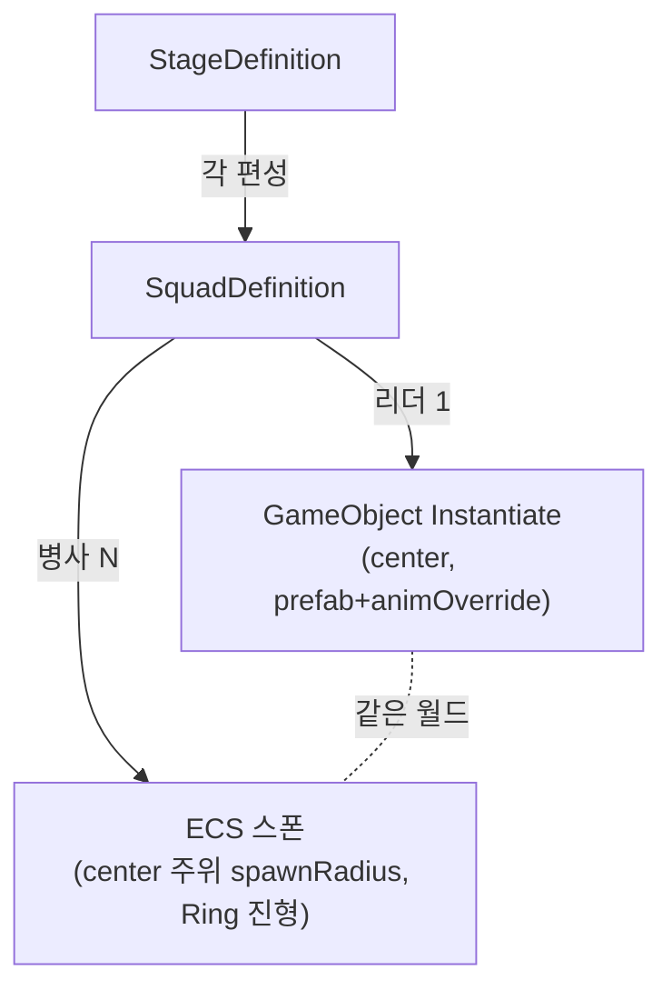

# Week 8 — 보스·엘리트 티어 & 편성 스폰 (설계)

> **설계 문서(구현 전 세팅).** 무쌍식 "편성(장수+병사)"을 데이터로 세우고, 티어별 월드(ECS 병사 / GO 장수)를 잇는 구조를 먼저 확정한다. 이 문서에서 데이터 모델·스탯·스폰 흐름을 못박은 뒤 → 데이터 에셋·스폰 코드로 내려간다.
> 계획: [`작업계획.md`](작업계획.md) · 히트스톱(리더 사망 트리거의 소비처): [`Week6-VAT-군중애니메이션.md`](Week6-VAT-군중애니메이션.md)의 후속 P1.

---

## 1. 컨셉 — 삼국무쌍 편성

세계는 **"편성(Squad)"의 집합**이다. 편성 = **리더 1 + 병사 N**.

| 리더 | : 병사 |
|---|---|
| **엘리트(부장)** 1 | ~100 |
| **보스(장수)** 1 | ~300 |

플레이어는 **병사 바다를 헤치며 편성의 리더(부장/장수)를 잡는 것**이 목표다. 리더 처치 = 그 편성의 상징적 와해 + **손맛(히트스톱·연출)**. 잡몹 병사는 쓸어담는 스펙터클, 리더는 "한 방의 카타르시스".

---

## 2. 티어 = 월드 (이미 있는 뼈대)

`Simulation.Data.MonsterTier` enum이 이미 티어를 월드로 가른다:

| 티어 | 월드 | 렌더/애니 | 규모 |
|---|---|---|---|
| **Normal(병사)** | **ECS** | VAT 인스턴싱 (1드로우콜) | 수천~1만 |
| **Elite(부장)** | **GameObject** | SkinnedMeshRenderer + Animator Override | 소수(수~수십) |
| **Boss(장수)** | **GameObject** | 〃 | 1~소수 |

> **근거**: `SkinnedMeshRenderer` + `AnimatorOverrideController`는 GO Animator 개념이라 1만 ECS엔 못 쓴다([Week6 A/B](Week6-VAT-군중애니메이션.md)에서 SMR이 N에 선형 붕괴 → VAT 55×). **소수 리더만 GO**, 대량 병사는 ECS/VAT. → *티어가 곧 월드*다. (`MonsterTier` 주석 그대로.)

---

## 3. 데이터 구조

### 3.1 기존 — `MonsterDefinition` (SO, 이미 정의됨)

몬스터 1종의 authoring 소스. 이미 필드는 다 있고 **아직 배선만 안 됨**:
- 식별: `id · displayName · tier`
- 스탯: `hp · speed · stopDistance · attackDamage · attackCooldown · attackRange`
- Normal 비주얼(ECS): `mesh · material · scale`
- Elite/Boss 비주얼(GO): `prefab · animOverride`

> ⚠️ **미배선**: 지금 스탯이 `MonsterAuthoring`에 하드코딩+중복. → `MonsterDefinition`으로 일원화(배선 단계에서 `MonsterBaker`가 여기서 읽도록).

### 3.2 신규 — `SquadDefinition` (SO)

편성 1개 = 리더 + 병사 구성:
```
leader       : MonsterDefinition   (Elite/Boss)
soldier      : MonsterDefinition   (Normal)
soldierCount : int                 (엘리트 100 / 보스 300)
spawnRadius  : float               (리더 중심 병사 반경)
formation    : enum {Ring, Filled} (진형 — 원형/채움; 우선 Ring)
```

### 3.3 신규 — `StageDefinition` (SO)

한 판의 편성 배치:
```
squads : [ { squad: SquadDefinition, center: float3, heading: float } ... ]
```
= "부장 편성 3 + 장수 편성 1" 식으로 스테이지를 데이터로 조립.

> **확정 스테이지(2026-07-27)**: **보스 1편성(호위 300) + 엘리트 10편성(각 호위 100)** = **리더 11기(GO) + 병사 1,300(ECS/VAT)**. 리더는 11기라 GO 비용 감당 범위.

---

## 4. 스탯표 (제안 — 병사=1× 기준, 밸런싱 대상)

| 티어 | HP | dmg | speed | scale | 호위 | 처치 히트스톱 |
|---|---:|---:|---:|---:|---:|---|
| Normal(병사) | 100 | 10 | 3.0 | 1× | — | — |
| **Elite(부장)** | **1,000** | **15** | 3.5 | 1.5× | 100 | 중 (0.10s) |
| **Boss(장수)** | **4,000** | **30** | 3.0 | 2.0× | 300 | 대 (0.20s) + 무쌍 연출 |

> **확정(2026-07-27)**: HP·dmg는 초안(엘리트 2000/30, 보스 8000/60)의 **÷2**. speed·scale·호위·히트스톱 유지. 이후 손맛 튜닝 대상.
> **비주얼 소스 확정**: 엘리트 = `ARPGWarrior`, 보스 = `ARPGSamurai` (`ArtResource/ARPGPack`, 둘 다 풀 애니 세트 — 콤보·공격·사망 클립 보유 → Animator Override로 각 티어 클립 덮음). 플레이어 = IdaFaber HornedKnight, 병사 = Toon Zombie(VAT).

---

## 5. 편성 스폰 설계

**현재**: `SpawnConfig(Prefab 1개 × Count × Radius)` — 단일 프리팹만. → 편성 기반으로 확장.



- **병사(ECS)**: 기존 ECS 스폰 재사용 — `SpawnConfig`에 `soldierDef`(mesh/material/scale·스탯) + 스폰 중심/반경을 편성 단위로. VAT 렌더 그대로.
- **리더(GO)**: `MonsterDefinition.prefab`을 `center`에 `Instantiate`, `animOverride` 적용. 소수라 GO 비용 감당.
- **총 병사 수 = Σ squad.soldierCount.** ⚠️ **스케일 주의**: 리더는 GO라 비싸다 → 리더는 **수십 기 이내**. 1만 스펙터클은 병사(ECS)로 채우고 리더는 소수 유지(예: 부장 5~10 + 장수 1~2).

---

## 6. 리더 아키텍처 — 결정 기록 (ADR)

> **결정(2026-07-27): "ECS 엔티티 + GO 비주얼 팔로워" 하이브리드로 간다.**
> 리더(엘리트/보스)의 **시뮬레이션(HP·피격·이동·사망)은 ECS 엔티티가 소유**하고, **GameObject(Warrior/Samurai)는 그 엔티티를 매 프레임 따라가는 비주얼(SkinnedMeshRenderer + Animator)** 로만 존재한다. 초안(§6 구버전)의 "HP를 GO가 소유(순수 GO 리더)"를 **폐기**하고 이 방향으로 정정.

### 6.1 후보 두 안

| | **A. ECS 엔티티 + GO 비주얼** (채택) | B. 순수 GO 리더 (초안) |
|---|---|---|
| HP·피격·사망 | ECS 엔티티(spatial hash 편입) | GO MonoBehaviour |
| 비주얼 | GO(팔로워) | GO(네이티브) |
| 플레이어→리더 피격 | **기존 `AttackResolveSystem`이 자동 처리**(리더도 hash 안에 있으니) | GO 피격판정 **신규**(히트프레임 OverlapSphere + 리더 리스트) |
| 사망→히트스톱 | `DeathEvent`에 `Tier` 한 필드 추가 → main 트리거가 큐에서 읽음 | GO 사망핸들러→ECS `HitStop` 세팅(GO→ECS 브릿지 신규) |
| Animator | ECS 상태→Animator 동기 브릿지 1개 필요 | 네이티브(가장 깔끔) |

### 6.2 A를 추천/채택한 이유

1. **기존 전투 파이프라인 100% 재사용 → "리더 사망"까지 최단.** 플레이어 공격은 이미 `AttackRequest → AttackResolveSystem(spatial hash) → DamageApplySystem(HP·DeadTag) → DeathSystem(DeathEvent)` 로 완결돼 있다. 리더를 **고HP·티어태그를 단 Enemy 엔티티**로 hash에 넣기만 하면 피격·데미지·사망이 **새 코드 0줄**로 동작한다. B는 이 파이프라인을 GO 쪽에서 처음부터 다시 만들어야 한다.
2. **히트스톱 훅이 가장 깔끔.** 목표(P1)는 "리더 사망 → 히트스톱"이다. A에선 `DeathEvent`에 `Tier`만 실으면 main의 트리거가 큐를 읽어 강도를 정한다(엘리트=중, 보스=대). 이벤트 소스가 이미 ECS 큐라 GO→ECS 역방향 브릿지가 불필요.
3. **시뮬레이션 단일화 = DOTS 포폴 서사에 부합.** "수천 병사도, 소수 리더도 **시뮬은 전부 ECS**, GO는 히어로 비주얼만" — 이게 VAT 군중 + GO 히어로 하이브리드의 더 강한 데모다. 이동도 기존 `MovementSystem`이 리더까지 커버.
4. **비용 대비 유일한 신규 부담이 작다.** A의 유일한 추가물은 "ECS 상태 → Animator 동기 브릿지"인데, 리더는 소수(11기)라 GO Animator 갱신 비용이 미미. B의 신규 피격판정·역브릿지보다 총량이 적다.

### 6.3 트레이드오프(감수하는 것)

- Animator를 ECS가 간접 구동(엔티티 상태 enum → `LeaderVisualBridge`가 `CrossFade`) → Animator가 상태를 완전히 소유하지 못함. 리더 수가 적어 허용.
- 리더 엔티티는 **렌더 컴포넌트 없이** 만들어야(GO가 그림) → Monster.prefab 재사용 불가, 별도 리더 아키타입 필요.

### 6.4 축별 방식 (채택안 기준)

| 축 | 방식 | 재사용 |
|---|---|---|
| HP·피격·사망 | ECS 엔티티(Enemy+Health+TierTag+LeaderTag, spatial hash) | `AttackResolveSystem`·`DamageApplySystem`·`DeathSystem` 그대로 |
| 이동 | 기존 `MovementSystem`(플레이어 추적) | 그대로 |
| 가해(리더→플레이어) | 기존 `EnemyAttack`+`PlayerDamageQueue` | 그대로 |
| 비주얼/애니 | `LeaderVisualBridge`(GO 스폰·추적·Animator 동기) | 신규 1개 |
| **사망 → 히트스톱** | `DeathEvent.Tier` → main 트리거가 소비 | **P1 히트스톱 STEP 3 = 이 훅** |

> 리더 사망 = 히트스톱 트리거의 정체. 엘리트=중, 보스=대+슬로모(`_AnimTime` 배속). 병사(Normal)는 트리거 안 함(영구 프리즈 방지).

---

## 7. 구현 단계 (설계 확정 후 — 이 문서 다음)

1. ✅ **데이터 에셋**: `MonsterDefinition`(Soldier/Elite/Boss) + `SquadDefinition`(Elite/Boss) + `StageDefinition`(Stage_01) SO 생성·세팅 **완료**. 비주얼 배선 완료 — 병사 mesh/material = `Zombie_M01_Aggro_VATMesh`(VAT), 엘리트 prefab = `ARPG_Warrior`(FBX), 보스 prefab = `ARPG_Samurai_Humanoid`. `animOverride`는 base 컨트롤러 확정 후(현재 null). → `Assets/Data/Monsters/`, 브랜치 `feat/boss-elite-formation`.
2. **스탯 배선**: `MonsterBaker`가 `MonsterDefinition`에서 스탯 읽도록(현재 하드코딩 중복 제거).
3. **Spawn 확장**: 편성 기반(리더 GO 배치 + 병사 N ECS 스폰).
4. **GO 리더**: HP·이동·피격·사망.
5. **히트스톱 트리거 연결**(P1 STEP 3).
6. **리더 고유 무브셋/패턴**(심화 — 광역·처형 등).

---

## 8. 열린 결정 (확정 필요)

- [x] 엘리트/보스 **스탯·호위 수** — ✅ 초안 ÷2 (엘리트 HP1000/dmg15, 보스 HP4000/dmg30), 호위 100/300
- [x] 스테이지 **규모** — ✅ 보스 1 + 엘리트 10 = 리더 11기, 병사 1,300
- [x] 리더 **메시/애니 소스** — ✅ **엘리트 = `ARPGWarrior` · 보스 = `ARPGSamurai`** (ARPGPack, 둘 다 풀 애니 세트). 나머지 후보(Halberd·DualWield)는 추가 티어/변형용 보류.
- [x] 리더 **피격 판정** 방식 — ✅ **ECS 편입**(spatial hash). §6 결정: 리더도 Enemy 엔티티라 기존 `AttackResolveSystem`이 자동 판정. GO 콜라이더 별도판정 폐기.
- [x] 플레이어 공격이 리더에 닿는 구조 — ✅ 기존 근접/광역 `AttackRequest` 그대로. 리더가 hash 안에 있어 반경 판정에 포함 → 재사용 범위 100%.
- [ ] 리더 **Animator 동기** 방식 (ECS 상태 enum → `LeaderVisualBridge` CrossFade 매핑; STEP D)
